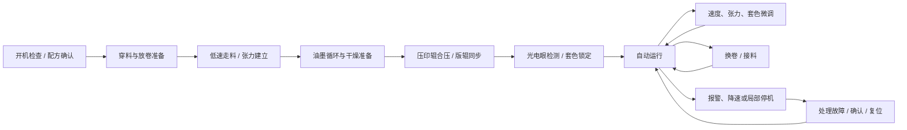
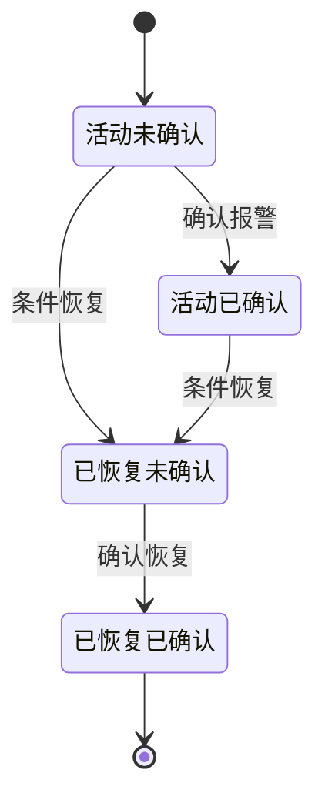

# VISU·19 Web HMI UI 优化复审

> 文档性质：基于产品计划、前端实操考核标准、现有代码和现实凹版印刷机操作语义的二次 UI 复审
>
> 适用页面：`/overview` 整机浏览、`/lock-mark` 锁定标记
>
> 设计基准：`1920×1080`、`16:9` 工业触摸屏
>
> 复审日期：2026-08-14

## 0. 范围冻结：本次不增加新的功能

本文件只审查和优化当前已经存在的页面功能，不新增业务能力、控制能力或新的页面入口。

本次允许调整：

- 页面布局、间距、字号、对比度和响应式降级方式。
- 已有字段的中文名称、英文辅助名称、单位、分组和显示优先级。
- 已有运行状态、报警状态、选中态、数据状态的视觉表达。
- 已有按钮的文案、触控尺寸、反馈提示和行为语义修正。
- 已有整机浏览、PU 详情、锁定标记、画框、曲线刷新、报警确认等功能的可用性优化。

本次明确不做：

- 不新增换卷、接料、示教、重新锁定、配方、权限、审计或 PLC 控制。
- 不新增趋势图、历史记录、质量追溯或新的报警处理入口。
- 不新增版辊、压印辊、刮刀、干燥或油墨的设备控制按钮。
- 不因为字段语义复审而扩展数据源；当前没有数据的字段不伪造、不要求补齐。
- 不把 P1/P2 设计储备转化为本次 UI 改造任务。

真实凹版印刷机字段仅用于校准现有字段的含义和标签，不代表新增功能。

## 1. 复审结论

当前页面的总体方向是正确的：采用整线 2.5D Canvas、右侧上下文面板、底部状态与速度区，并用独立曲线 Canvas 完成色标检测。这比原始 1280×1024、4:3 传统工控画面更适合本次考核，也符合产品计划中“总览优先、详情按需展开、数据驱动视图”的目标。

上一轮 UI 意见需要做以下修订，才能同时满足考核口径和真实凹版印刷机语义：

1. 不把单击 PU 直接跳到锁定标记作为 P0 要求。产品计划明确要求单击建立当前 PU 上下文并打开详情，右侧“查看 PU 检测曲线”是 P0 正式入口；双击 PU2-PU10 只作为 P1 快捷入口。
2. 不在首屏新增版辊、刮刀、干燥、油墨和换卷控制字段。对于当前已有的详情字段，只做工艺分组和标签校准，首屏继续优先保障状态判断和考核闭环。
3. “张力、压力、速度”必须加上对象和测量位置。裸字段会造成现场误判，例如“张力 83.2 N”无法判断是放卷、段间还是收卷张力。
4. 运行状态、报警状态、工艺颜色、选中态必须独立编码。PU 级停机不应自动把整机状态改成停止；普通 warning 也不能被渲染成 stop。
5. “适应视图”不能承担“收起详情”的功能。当前实现中 [OverviewPage.vue:62](/Users/jiangqianwen/projects/webHMI/src/components/OverviewPage.vue:62) 将“适应视图”绑定到 `setDetailOpen(false)`，应拆分为“重置视图”和“收起详情”。
6. 1920×1080 是硬性基准。1280×720 的简化布局只能作为降级策略，不能以隐藏报警、数据新鲜度或最新事件换取视觉空间。

最终目标不是展示更多数字，而是让操作员在 3 秒内回答：

```text
材料是否正在走料？
整线当前速度是多少？
是否有活动报警？
报警来自哪一个印刷单元？
下一步应该查看详情、曲线，还是处理设备故障？
```

## 2. 复审依据与验收映射

### 2.1 依据文件

- [产品计划.md](/Users/jiangqianwen/projects/webHMI/document/产品计划.md)：当前执行基线，明确 P0/P1/P2、布局、字段、报警和检测窗规则。
- [前端工程师二面实操考核试题(1).pdf](/Users/jiangqianwen/projects/webHMI/document/前端工程师二面实操考核试题(1).pdf)：明确两个核心界面、触控场景、1920×1080 重排、模拟数据和演示要求。
- [OverviewPage.vue](/Users/jiangqianwen/projects/webHMI/src/components/OverviewPage.vue)：当前整机浏览页面结构和字段展示。
- [MachineCanvas.vue](/Users/jiangqianwen/projects/webHMI/src/components/MachineCanvas.vue)：整线 Canvas 的命中、状态和动画实现。
- [LockMarkPage.vue](/Users/jiangqianwen/projects/webHMI/src/components/LockMarkPage.vue)：锁定标记页面和曲线交互。
- [hmi.js](/Users/jiangqianwen/projects/webHMI/src/stores/hmi.js)、[mockMachineSource.js](/Users/jiangqianwen/projects/webHMI/src/data/mockMachineSource.js)：状态、报警、信号帧和定时刷新边界。

### 2.2 考核要求与本次 UI 结论

| 考核/产品要求 | 当前 UI 结论 | 优先级 |
| --- | --- | --- |
| 放卷 → 10 个印刷色组 → 收卷 | 保留整线横向流程，走料路径始终可见 | P0 |
| 车速、整机状态、10 个色组状态和报警 | 顶部表达整机，Canvas/状态带表达 PU，报警单独显示 | P0 |
| 整机状态每 1 秒刷新 | Mock 数据必须发布完整、可重复的整机快照，不只刷新时间和速度 | P0 |
| 1920×1080 无滚动、无内容截断 | 以 80px 顶栏 + 1000px 工作区约束布局 | P0 |
| 单击 PU 查看详情 | 单击只建立上下文并打开详情，不直接跳页 | P0 |
| “查看 PU 检测曲线” | 作为跨页面正式入口，并传递 PU 上下文 | P0 |
| 双击 PU2-PU10 | 如果当前版本已有该快捷入口则保留；不新增双击功能 | 仅复核 |
| 1200 点、500ms/帧曲线 | 保留独立信号源、按 PU 分桶、只绘制当前 PU | P0 |
| 触控画框与坐标换算 | 统一使用 `plotRect` 和数据坐标，保存 `xMin/xMax/yMin/yMax` | P0 |
| 已绘制窗口拖动、缩放、删除 | 只复核当前已有操作和视觉反馈，不新增窗口能力 | 仅复核 |
| 收放卷参数和速度操作 | 只优化当前已有字段和按钮的文案、层级与触控反馈，不增加换卷控制 | 仅复核 |
| 20 秒录屏 | 产品计划当前将其定义为可选补充；原考题将其列为截止提交项，建议仍按较严格口径准备 | 交付风险 |

原考题的录屏要求和当前产品计划的“可选补充交付”口径存在差异。代码验收按产品计划执行，但实际交付时建议仍准备包含以下四段的约 20 秒录屏：整机状态刷新、页面切换、一次完整画框、曲线持续刷新。

## 3. 现实凹版印刷机操作流程与页面映射

真实凹版印刷机的操作不是“点击颜色卡片后改几个数字”，而是承印材料、张力、凹版辊、压印辊、刮刀、油墨、干燥和套色检测共同形成的连续工艺。

### 3.1 现场主流程



### 3.2 UI 对操作流程的责任边界

| 现场流程 | `/overview` 应表达什么 | 本次考核是否直接控制 |
| --- | --- | --- |
| 开机检查 | 订单、材料幅宽、活动轴、数据状态 | 否，仅展示 |
| 穿料与张力建立 | 放卷/收卷轴、摆臂、张力和走料状态 | 否 |
| 低速走料 | 实际线速度、目标速度、加减速阶段、材料运动 | 可模拟，不连接设备 |
| 印刷单元运行 | PU 状态、凹版辊/压印辊关系、工艺颜色 | 否，原理图只解释关系 |
| 套色检测 | PU2-PU10 曲线、检测窗、首色/前色/本色参考线 | 曲线和检测窗可操作 |
| 套色微调 | 纵向/横向偏差、检测窗位置、版辊微调值 | 只按当前已有字段解释，不新增示教或设备控制 |
| 换卷/接料 | 只保留当前页面已有的 A/B 轴、卷径等信息 | 不新增换卷或接料操作 |
| 报警处理 | 来源、严重级别、影响范围、活动/恢复/确认状态 | 只优化当前已有报警展示和确认入口 |

## 4. 目标信息架构与布局

### 4.1 1920×1080 基准

按照产品计划，采用：

```text
顶部全局状态栏       80px
内容工作区          1000px
左侧导航             96px
工作区左右内边距      24px
标准间距              8px 基线 / 16-24px 面板间距
普通触控目标          不小于 48×48px
关键操作目标          建议 56px 高
正文                  不小于 18px
生产关键数字          28-40px
```

在 1920×1080 下必须满足：

```text
document.documentElement.scrollHeight <= 1080
document.documentElement.scrollWidth <= 1920
```

### 4.2 总览模式

```text
顶部：订单 / 材料 / 实际速度 / 整机状态 / 报警 / 时间
左侧：整机浏览、锁定标记、报警辅助、设置
中央：放卷 → PU01-PU10 → 收卷的横向 2.5D Canvas
右侧：180-240px 当前上下文窄摘要
底部：目标速度、速度模式、卷径/张力摘要、最新事件
```

首次进入时不选中任何 PU。右侧显示整线状态、实际线速度、需处理报警、最新来源和数据状态，不把某个 PU 伪装成默认焦点。

### 4.3 详情模式

单击 PU、点击对应报警锚点或点击“查看详情”后：

- 主区域切换为当前 PU 的单个印刷单元原理图。
- 右侧面板展开到约 360-420px。
- 原理图显示承印材料、压印辊、凹版辊、油墨槽、刮刀、光电眼和走料方向。
- 原理图只用于解释设备关系和信号来源，不直接执行启停、压力、速度或刮刀控制。
- 右侧首屏显示当前状态、报警、套色偏差、光电眼状态、段间张力和检测曲线入口。

### 4.4 小尺寸降级策略

1280×720 不是本次考核主基准，但应提供安全降级：

- 保留顶部运行状态和报警摘要，只压缩文字，不隐藏状态点。
- 右侧详情改为抽屉覆盖层，不与 Canvas 永久并排挤压。
- Canvas 保持最低可观察高度；本次不新增趋势图，已有非关键信息只做折叠或降级，不隐藏报警。
- 最新事件移动到报警抽屉，不直接删除。
- “数据正常/数据延迟”缩为状态点 + 短文案，不完全隐藏。
- 底部操作区改成两行或可展开的命令条。

### 4.5 视觉语义

| 语义 | 视觉规则 | 说明 |
| --- | --- | --- |
| 工艺颜色 | PU 下版辊底部彩色半圆弧 | 只表示油墨/印刷色，不表示状态 |
| 正常运行 | 绿色状态点 + “运行” | 材料在走、单元辊筒同步运动 |
| 单元停止 | 中性灰状态点 + “停止” | 单元停止不等于整线停止 |
| 警告 | 黄色/橙色点 + “警告” | 不自动覆盖真实运行状态 |
| 停机级报警 | 红色菱形/状态点 + “停机” | 按影响范围停止 PU 或整机 |
| 信号异常 | 信号图标 + “信号中断/恢复中” | 不能伪装成普通停止 |
| 当前选中 | 青蓝描边 + 右侧同步 | 不使用工艺色表示选中 |
| 数据状态 | 单独的“数据正常/数据延迟”标签 | 不等同于设备健康 |

## 5. 凹版印刷字段语义字典

本节只规定已有字段在界面中的正确叫法、单位和分组，不要求新增字段或新增控制项。若当前数据模型没有某个字段，界面继续隐藏该字段，不用模拟数字填充。

### 5.1 L1 全局常驻字段

| 字段 | 推荐标签 | 单位/状态 | 语义 |
| --- | --- | --- | --- |
| `orderNo` | 工单号 | 文本 | 当前生产订单或作业批次 |
| `webWidthMm` | 材料幅宽 | mm | 承印材料横向有效宽度，不等于设备最大幅宽 |
| `speedMpm` | 实际线速度 | m/min | 当前材料真实速度，不是设定目标 |
| `targetSpeedMpm` | 目标线速度 | m/min | 操作员或配方设定目标，实际速度需要平滑追踪 |
| `motionPhase` | 速度阶段 | 加速/稳速/减速/停止 | 解释实际速度为何暂时不等于目标值 |
| `runState` | 整线状态 | 运行/停止 | 由整线运动状态决定，不由普通 warning 决定 |
| `linked` | 主从同步 | 已启用/未启用 | 表示线速度、张力、版辊驱动是否处于联动控制 |
| `highestAlarm` | 最高报警级别 | 正常/警告/停机 | 只表达报警汇总，不覆盖运行状态 |
| `activeAlarms` | 活动报警 | 数量 | 故障条件仍存在的报警数 |
| `pendingAlarms` | 待确认 | 数量 | 操作员尚未查看或确认的报警数 |
| `machineDataStatus` | 数据状态 | 正常/延迟 | 表示通信或快照更新时间，不等于设备健康 |

### 5.2 L2 放卷、收卷和张力

| 字段 | 推荐标签 | 单位 | 现场含义 |
| --- | --- | --- | --- |
| `activeAxis` | 当前活动轴 | A/B | 当前承载运行卷的轴，不是备用轴 |
| `diameterMm` | 当前卷径 | mm | 用于剩余长度、张力控制和换卷判断 |
| `lengthM` | 当前卷剩余长度 | m | 比卷径更直接地支持换卷预判 |
| `alarmThresholdMm` | 卷径低限 | mm | 到达后提示准备换卷，不等于立即停机 |
| `armPositionPct` | 摆臂位置 | % | 反映储料摆臂或张力摆臂的位置 |
| `tensionN` | 放卷/收卷张力 | N | 必须标明测量位置和对象 |
| `targetTensionN` | 张力目标值 | N | 控制目标，不等于当前反馈 |
| `spliceState` | 接料状态 | 未准备/准备中/接料中/完成 | 仅当现有数据已经提供时用于正确命名；本次不新增 |
| `totalLengthM` | 累计走料长度 | m | 当前订单或本次作业累计长度 |

页面上不再使用单独的“张力 83.2 N”，而应使用：

```text
放卷张力 83.2 N
段间张力 81.9 N
收卷张力 81.7 N
```

### 5.3 L3 印刷单元字段

| 字段 | 推荐标签 | 单位 | 现场含义 |
| --- | --- | --- | --- |
| `station.runState` | PU 状态 | 运行/停止 | 当前印刷单元是否运行 |
| `driveState` | 凹版辊驱动 | 运行/停止/故障 | 驱动反馈状态，不等同于印刷质量 |
| `impressionState` | 压印状态 | 合压/脱压 | 压印辊是否与凹版辊形成印刷压力 |
| `registerMode` | 套色模式 | 自动/手动/锁定 | 当前套色控制方式 |
| `plateRpm` | 凹版辊转速 | rpm | 版辊真实转速；应与线速度和印刷周长相关 |
| `interstageTensionN` | 段间张力 | N | 当前 PU 前后材料段的张力 |
| `longitudinalMm` | 套色纵向偏差（MD） | mm | 沿走料方向偏离参考位置 |
| `lateralMm` | 套色横向偏差（CD） | mm | 横向偏离目标位置 |
| `doctorBladePressure` | 刮刀压力 | bar 或配置单位 | 控制网穴外多余油墨的刮除压力 |
| `doctorBladeAngle` | 刮刀角度 | deg | 影响刮墨状态和印刷均匀性 |
| `impressionPressure` | 压印辊合压压力 | bar 或配置单位 | 影响油墨转移和材料受力 |
| `inkViscosity` | 油墨黏度 | s + 测量方法 | 必须标明 Zahn/Ford 等测量方法 |
| `inkTemperature` | 油墨温度 | °C | 影响黏度和转移稳定性 |
| `dryerSetpoint` | 干燥设定温度 | °C | 工艺目标值 |
| `dryerActual` | 干燥实际温度 | °C | 温度反馈值 |
| `dryerAirflow` | 干燥风量 | % 或 m³/h | 影响溶剂挥发和干燥能力 |

### 5.4 光电眼、检测窗和参考色

| 字段 | 推荐标签 | 语义 |
| --- | --- | --- |
| `lockEye` | 光电眼状态 | 未配置、在线、信号中断、信号恢复中 |
| `latestReceivedAt` | 最新接收帧 | 若现有 Store 已提供则正确标注时间；本次不新增数据 |
| `displayedAt` | 最后显示帧 | 若现有 Store 已提供则用于解释冻结状态；本次不新增数据 |
| `xMin/xMax` | 采样位置范围 | 检测窗在 0-1199 采样序列中的范围 |
| `yMin/yMax` | 信号强度范围 | 检测窗在 0-100% 信号量程中的范围 |
| `first` | 首色参考 | 套色计算的主参考基准 |
| `previous` | 前色参考 | 相邻前一个色组的辅助参考 |
| `current` | 本色检测峰 | 当前 PU 的实际色标峰/谷 |
| `signalStatus` | 信号状态 | 实时、手动冻结、编辑冻结、中断、恢复中 |

必须区分：

```text
首色印刷色组：订单/工艺中的实体色组
首色参考基准：套色算法计算使用的参考位置
```

“检测窗”不是设备机械位置，也不是参考线。检测窗调整影响信号识别和纵向偏差；版辊横向微调是独立的设备参数，主要影响横向偏差。

### 5.5 报警字段

每条报警至少包含：

```text
来源：整机 / PU / 光电眼
对象：MACHINE / PU04 / Photoeye04
等级：warning / stop
影响范围：station / machine
标题与说明
发生时间
活动状态
确认状态
恢复时间
```

报警状态必须遵循：

```text
活动未确认 → 活动已确认 → 条件恢复未确认 → 已恢复已确认
```

确认报警只表示“人工已查看”，不代表故障已经恢复，也不允许自动复位或自动重启设备。

## 6. 操作逻辑复审

### 6.1 整机浏览

```text
首次进入
  → 不选中 PU
  → 显示整线 Canvas 和窄摘要

单击 PU
  → 更新 selectedStationId
  → Canvas 青蓝高亮
  → 打开 PU 详情和单元原理图

点击“查看 PU 检测曲线”
  → 跳转 /lock-mark?pu=PUx
  → 自动恢复该 PU 的曲线、检测窗、偏差、信号状态

在锁定标记页点击“返回整机”或主导航“整机浏览”
  → 先处理未应用的检测窗修改
  → 返回 /overview
  → 清除 selectedStationId、sourceStationId 和报警定位上下文
  → 取消原 PU 高亮并显示整线摘要

点击“返回整线总览”
  → 回到全宽整线 Canvas
  → 清除当前 selectedStationId 和报警定位上下文
  → 取消 PU 高亮并恢复整线摘要
  → URL 恢复为 /overview
```

新报警出现时不自动打开详情、不自动移动 Canvas。点击报警锚点后才定位到对应对象。

### 6.2 双击规则

双击不是 P0 的必要闭环：

- 若当前版本已有双击行为，PU2-PU10 可继续作为快捷进入对应锁定标记的入口；本次不新增该行为。
- PU1：保留当前产品取舍，详情可看，但锁定标记入口禁用并说明“PU1 暂无锁定标记检测”。
- 第一次点击必须立即产生选中态；即使双击识别失败，单击详情仍然可用。

### 6.3 速度操作

总览页可以显示并模拟速度操作，但不能让 UI 语义暗示已经接入真实设备。

建议显示：

```text
实际线速度 20.3 m/min
目标线速度 24.0 m/min
状态：加速中
模式：自动
范围：0-150 m/min
```

交互规则：

- 速度预设保留 `24 / 36 / 120 / 150 m/min`。
- 若当前版本已有手动升速/降速按钮，只优化其触控反馈和文案；本次不新增长按、二次确认或新的速度控制方式。
- 实际速度平滑追踪目标速度，不能瞬间跳变。
- 速度调整不自动清除报警。
- 有停机级报警时，目标速度可以继续展示，但执行状态应提示“受联锁限制”。

### 6.4 锁定标记流程


规则：

- 每个 PU 只维护一个检测窗。
- 有曲线但没有已保存窗口时，可显示默认草稿；草稿未确认前不参与偏差和报警。
- 已保存窗口拖动主体改变 `xMin/xMax`，手柄调整对应 X/Y 范围。
- 曲线平移、缩放只改变视口，不改变检测窗数据。
- 编辑期间自动临时冻结曲线显示；后台仍接收数据并执行报警判断。
- 手动冻结只冻结显示帧，不停止后台接收。
- 无信号时保留最后一帧，显示“信号中断”，偏差显示 `—`，不能显示旧数据的假实时结果。
- 若当前版本已有删除或重新创建入口，只优化确认文案和状态提示；本次不新增删除、替换或草稿功能。

### 6.5 报警处理



PU07 的“版辊驱动停机”应显示为：

```text
来源：PU07 凹版辊驱动
等级：停机级
影响范围：PU07
状态：活动 / 待确认
建议：检查驱动反馈，处理后复位并重新启动 PU07
```

PU04 的“套色偏差预警”应保持 PU04 的运行状态不变，只显示 warning。只有达到停机阈值并持续满足配置时间，才按影响范围生成 stop。

## 7. 数据驱动与工程边界

### 7.1 P0 数据刷新

```text
MockMachineSource：每 1s 发布完整整机快照
MockSignalSource：每 500ms 发布一帧完整 1200 点信号
Machine Store：保存整机、PU、报警、放卷/收卷状态
Signal Frame Buffer：按 PU 保存最新接收帧和显示帧
Mark Window Store：按 PU 保存检测窗、偏差、冻结和版辊微调
组件：只读取 Store 派生数据，不直接修改源数据
```

整机刷新不能清除：

- 当前选中 PU
- 曲线显示帧
- 检测窗
- 手动冻结状态
- 其他 PU 的报警和待确认状态

页面离开时必须清理定时器和订阅，重新进入不能出现重复推送或重复报警。

### 7.2 状态映射

```text
machine.runState      → 顶部状态、材料运动、放卷/收卷动画
station.runState      → PU 状态点、状态文字、辊筒运动
station.alarmState    → warning/alarm 锚点和报警卡片
selectedStationId     → Canvas 高亮、右侧详情、跨页上下文
signalStatus          → 曲线状态、最后帧时间、偏差可用性
```

状态脚本必须可重复，不能依赖不可控的随机变化，否则无法完成考核演示和代码走查。

### 7.3 不扩展数据模型

本次不改造数据结构，也不为字段语义新增数据源。只在页面已有字段上做显示映射：

```text
已有 tensionN       → 根据当前数据来源标注为放卷张力或段间张力
已有 rollerRpm      → 显示为凹版辊转速
已有 offsetLongitudinalMm → 显示为套色纵向偏差（MD）
已有 offsetLateralMm      → 显示为套色横向偏差（CD）
已有 doctorPressureBar    → 显示为刮刀压力
已有 impressionPressureBar → 显示为压印辊合压压力
已有 dryerTempC           → 显示为干燥温度
已有 inkViscosityS        → 显示为油墨黏度，并保留当前单位
```

如果当前数据无法区分测量位置，界面应显示“张力”并通过上下文说明，而不是擅自生成“收卷张力目标值”等新数据。后续真实设备字段可以在独立需求中建模，本次不纳入 UI 优化。

## 8. 视觉和交互验收清单

### 8.1 P0 必须通过

- [ ] 1920×1080 下两个页面无纵向滚动和横向溢出。
- [ ] 首次进入整机浏览不默认选中 PU。
- [ ] 3 秒内能看出整机运行状态、实际线速度、报警数量和报警来源。
- [ ] 顶部运行状态点与文字同源，不出现绿色圆点 + “停止”的矛盾组合。
- [ ] 10 个 PU 均有运行/停止和 warning/stop 的可识别表达。
- [ ] 工艺颜色不与报警颜色或选中态混淆。
- [ ] 单击 PU 打开详情；右侧文字按钮进入对应检测曲线。
- [ ] PU1 保持不可进入曲线的当前产品取舍，并显示明确说明。
- [ ] 整机状态快照每 1s 刷新，颜色、图标和有限动画跟随变化。
- [ ] 曲线每 500ms 接收一帧完整 1200 点数据，并保持流畅。
- [ ] 画框位置随 Canvas 尺寸变化仍对应数据坐标。
- [ ] 信号暂时未到时保留最后一帧并显示信号状态，不用零值伪装正常。

### 8.2 已有功能的表现复核

以下项目只在当前版本已经存在时进行回归检查，不作为新增功能任务：

- [ ] 双击 PU2-PU10 的已有快捷入口不影响单击详情。
- [ ] 当前已有检测窗操作的按钮、手柄和状态文案清晰可读。
- [ ] 当前已有冻结、信号中断、报警确认等状态与真实数据一致。
- [ ] 首色、前色、本色的已有参考线和偏差表使用正确术语。
- [ ] 当前已有的检测窗、版辊微调和偏差数据不会因切换 PU 而串用。
- [ ] 当前已有报警按严重级别、影响范围、活动/确认状态和发生时间正确表达。

未实现的 P1/P2 功能不在本次 UI 优化中补做。

## 9. 本次 UI 优化执行清单

以下都是已有功能的界面优化，不增加新的业务功能：

1. 修正 1920×1080 纵向布局，保证两个页面无滚动、无截断。
2. 将“适应视图”改为真正的视图重置，详情收起继续使用独立入口。
3. 调整顶部状态栏、Canvas 状态带、右侧详情和底部操作区的信息层级。
4. 将“车速”明确为“实际线速度”，将现有目标值和运行阶段分开表达。
5. 将现有“张力、版辊转速、纵向偏差、横向偏差、刮刀压力、压印压力、干燥温度、油墨黏度”按凹版印刷语义改名和分组。
6. 保持工艺颜色、运行状态、报警状态和选中态的视觉分离。
7. 保持单击 PU 查看详情、详情按钮进入检测曲线、现有画框和报警确认流程不变，只改善触控尺寸和反馈文案。
8. 在 1280×720 降级时压缩或折叠次要信息，不隐藏活动报警、运行状态和数据状态。
9. 不新增换卷、接料、示教、趋势、历史、权限、PLC 或新的设备控制。

## 10. 最终设计判断

这套 UI 应被定义为“凹版印刷整线状态与色标检测 HMI”，而不是通用数据看板。

首屏最重要的是：

```text
实际线速度
材料走料状态
整线运行状态
PU 状态和报警来源
放卷/收卷关键状态
当前数据是否新鲜
```

进入 PU 详情后才展开：

```text
套色纵向/横向偏差
段间张力
凹版辊转速
刮刀压力
压印辊合压压力
干燥设定/实际温度
油墨黏度和温度
光电眼与检测曲线
```

只有在锁定标记页面中，才让操作员编辑检测窗、观察参考线、确认信号和查看偏差。这样既保留考核要求的核心操作，又符合现实凹版印刷机中“先看整线、再定位单元、最后调整检测参数”的实际工作顺序。
