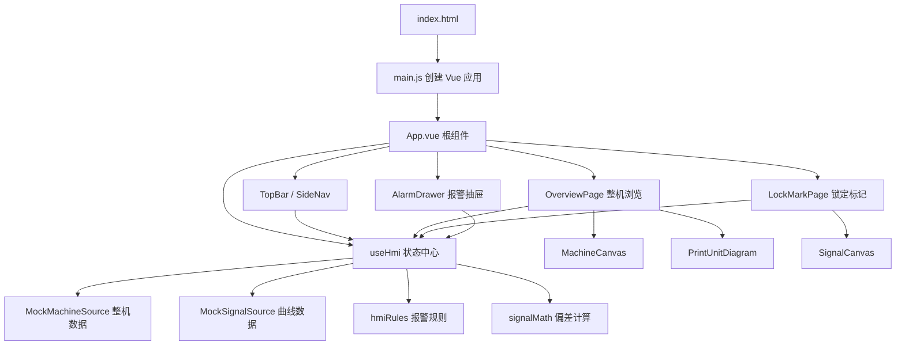
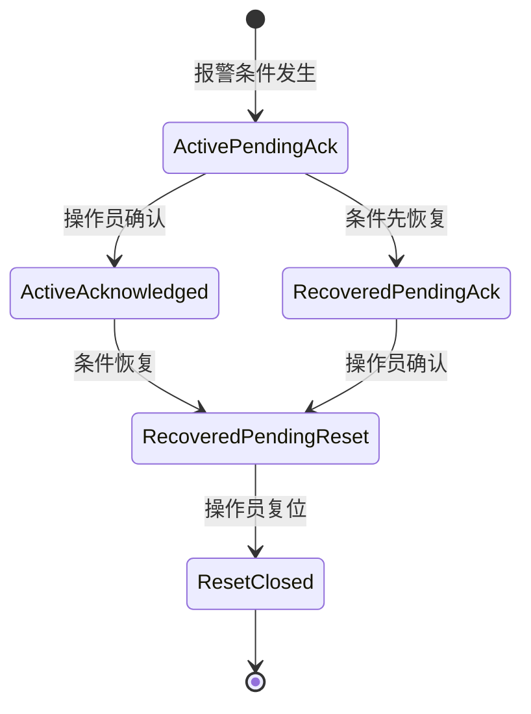
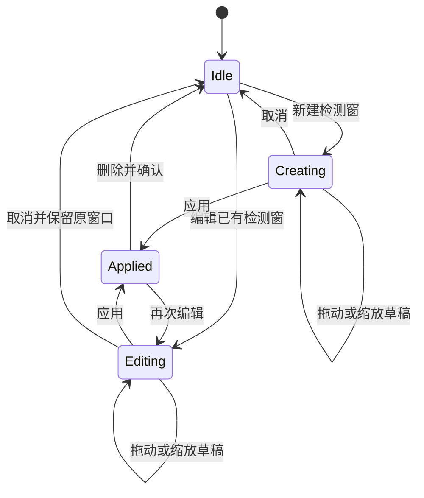

# VISU·19 Web HMI 代码说明文档

> 文档目标：帮助没有接触过当前代码的人，从“这个项目是做什么的”开始，逐步理解项目结构、封装方式、数据流、核心功能和后续修改入口。  
> 对应代码版本：2026-08-18 当前工作区  
> 技术栈：Vue 3、Vite、原生 Canvas 2D、原生 JavaScript、CSS  
> 项目性质：前端演示案例，不连接真实 PLC、数据库或后端服务

## 1. 先用一句话理解这个项目

这是一个用于印刷设备演示的 Web HMI：它在浏览器里模拟一条包含放卷、10 个印刷单元和收卷的生产线，让用户可以查看整机状态、进入某个 PU（印刷单元）、观察锁定标记曲线、编辑检测窗、查看套色偏差，并完成报警确认、故障恢复、复位和启动等操作。

这里的 HMI 是 Human Machine Interface，即“人机界面”。真实项目中它通常从 PLC 或设备控制器读取数据，再把操作指令发送回设备。当前版本只做前端演示，因此：

- 设备数据由前端模拟生成；
- 启动、调速、版辊偏移等操作只修改浏览器内存；
- 刷新页面后，整机和报警从相同初始状态重新开始；
- 检测窗使用 `sessionStorage` 在当前浏览器会话内保存；
- 当前代码不能直接控制真实设备

## 2. 你在页面上能看到什么

项目目前有两个主要页面和一个全局报警抽屉。

### 2.1 整机浏览

整机浏览页用于快速了解整条生产线：

- 顶部显示工单号、材料幅宽、实际线速度、整线状态、报警摘要和时间；
- 中央 2.5D Canvas 按工艺顺序绘制放卷、PU1–PU10 和收卷；
- Canvas 下方状态带显示每个 PU 的运行、警告、停机、待确认或待复位状态；
- 单击 PU 后，右侧显示该单元的参数、报警和简化原理图；
- 可以展开完整的印刷单元原理图；
- 可以调整模拟目标速度；
- 可以从 PU 详情进入对应的锁定标记页面。

### 2.2 锁定标记

锁定标记页用于查看 PU2–PU10 的模拟光电眼曲线：

- 每个信号帧包含 1200 个采样点；
- 默认每 500ms 生成并接收一帧；
- 显示首色、前色和本色参考线；
- 支持新建、移动、缩放和删除检测窗；
- 检测窗使用“草稿 → 应用”的事务式操作；
- 支持冻结显示、恢复实时、缩放和平移视口；
- 支持模拟信号中断和恢复；
- 根据检测窗内波峰计算纵向套色偏差；
- 可以模拟版辊横向偏移。

PU1 没有锁定标记入口，因此曲线页只提供 PU2–PU10。

### 2.3 报警处理

报警抽屉在两个页面上都可以打开，提供：

- 活动、待确认、待复位和需处理统计；
- 活动报警与已恢复报警分组；
- 报警确认；
- 停机级报警复位；
- 定位到整机、具体 PU 或具体曲线；
- 整机停止时的启动入口。

报警采用安全闭环：确认报警不等于故障恢复，故障仍活动时不能复位，复位也不等于自动启动。

## 3. 建议先认识的几个词

| 词语          | 在本项目中的含义                                         |
| ------------- | -------------------------------------------------------- |
| HMI           | 面向操作员的设备人机界面                                 |
| PU            | Print Unit，印刷单元；当前有 PU1–PU10                    |
| Store         | 集中保存页面状态和业务操作的模块；本项目是 `useHmi()`    |
| Snapshot      | 某一时刻完整的整机数据快照                               |
| Signal Frame  | 某一时刻的 1200 点曲线帧                                 |
| Signal Bucket | 某个 PU 独立保存的实时帧、显示帧和冻结状态               |
| 检测窗        | 曲线上的矩形数据范围，用于筛选目标波峰并计算偏差         |
| 草稿          | 用户正在调整、尚未正式应用的检测窗                       |
| active        | 报警条件是否仍存在                                       |
| acknowledged  | 操作员是否已经确认报警                                   |
| resetRequired | 停机报警是否保留复位锁存要求                             |
| pendingReset  | 当前是否已经满足复位条件，而不是简单等于 `resetRequired` |
| Canvas        | 浏览器原生位图绘图区域，项目用它绘制整机和曲线           |
| computed      | Vue 根据已有状态自动计算出的派生值                       |

## 4. 如何运行项目

在项目根目录执行：

```bash
npm install
npm run dev
```

然后打开：

```text
http://127.0.0.1:5173/
```

其他命令：

```bash
# 生成生产构建，输出到 dist/
npm run build

# 本地预览生产构建
npm run preview

# 运行项目自带的核心验收脚本
npm run test:acceptance
```

`dist/` 是构建产物，不应该直接手工修改。真正的源代码都在 `src/`。

## 5. 技术选型

| 技术           | 用途                   | 当前使用方式                             |
| -------------- | ---------------------- | ---------------------------------------- |
| Vue 3          | 页面组件和响应式状态   | 使用 Composition API 和 `<script setup>` |
| Vite           | 开发服务器和生产构建   | 默认端口 5173                            |
| JavaScript     | 业务逻辑               | 当前未使用 TypeScript                    |
| Canvas 2D      | 绘制整机和实时曲线     | 没有使用 Three.js 或图表库               |
| CSS            | 主题、布局和响应式适配 | 全局设计变量 + 响应式媒体查询            |
| sessionStorage | 保存检测窗             | 仅在当前浏览器会话内有效                 |
| History API    | 更新 URL               | 没有使用 Vue Router                      |

项目刻意保持依赖很少。运行时依赖只有 Vue，Canvas、路由和状态管理都使用原生浏览器能力或项目自己的封装。

## 6. 工程目录

下面只列出理解代码需要关注的文件：

```text
webHMI/
├── index.html                    浏览器入口 HTML
├── package.json                 命令和依赖
├── vite.config.js               Vite 配置
├── scripts/
│   └── acceptance.mjs           核心规则验收脚本
├── src/
│   ├── main.js                  创建 Vue 应用
│   ├── App.vue                  根组件和页面外壳
│   ├── styles.css               全局主题、布局、响应式样式
│   ├── stores/
│   │   └── hmi.js               全项目状态中心和主要业务动作
│   ├── data/
│   │   ├── mock.js              初始整机、报警和曲线帧数据
│   │   ├── mockMachineSource.js 整机 1 秒快照和 90 秒演示时间线
│   │   ├── mockSignalSource.js  曲线帧接收、冻结和中断恢复
│   │   ├── mockReferenceConfig.js 固定参考线配置
│   │   ├── signalMath.js        检测窗和偏差计算纯函数
│   │   └── hmiRules.js          报警生命周期和汇总纯函数
│   └── components/
│       ├── TopBar.vue           顶部状态栏
│       ├── SideNav.vue          左侧主导航
│       ├── OverviewPage.vue     整机浏览页
│       ├── MachineCanvas.vue    参数化 2.5D 整机绘制
│       ├── PrintUnitDiagram.vue 单个 PU 原理图
│       ├── LockMarkPage.vue     锁定标记工作台
│       ├── SignalCanvas.vue     曲线和检测窗绘制、指针交互
│       └── AlarmDrawer.vue      报警处理抽屉
└── document/                    产品、审查、演示和代码文档
```

## 7. 总体架构

项目可以理解为四层：入口与外壳、页面组件、状态中心、数据与规则。



最关键的一点是：组件不自己维护整机业务真相，整机、报警、信号和检测窗都集中在 `useHmi()` 中。组件主要负责展示状态和把用户动作转交给状态中心。

## 8. 页面是如何启动的

启动链路很短：

```text
浏览器加载 index.html
→ index.html 加载 src/main.js
→ main.js 创建 Vue 应用
→ Vue 挂载 App.vue
→ App.vue 调用一次 useHmi()
→ useHmi() 创建状态、模拟数据和定时器
→ App.vue 把 hmi 对象传给各页面组件
```

入口代码在 [`main.js`](../src/main.js)：

```js
createApp(App).mount("#app");
```

`#app` 来自根目录的 [`index.html`](../index.html)。全局 CSS 也在 `main.js` 中加载。

## 9. 先看懂 Vue 单文件组件

项目中的 `.vue` 文件叫单文件组件，通常由三部分组成：

```vue
<script setup>
// 数据、计算和事件函数
</script>

<template>
  <!-- 页面结构 -->
</template>

<style scoped>
/* 只作用于当前组件的样式 */
</style>
```

当前代码里常见的 Vue API：

| API                 | 作用                 | 项目示例                         |
| ------------------- | -------------------- | -------------------------------- |
| `ref()`             | 保存一个可变值       | 报警抽屉是否打开、确认条是否显示 |
| `reactive()`        | 保存一个响应式对象   | `hmi.js` 中的全局 `state`        |
| `computed()`        | 从其他状态计算结果   | 当前 PU、报警统计、当前偏差      |
| `watch()`           | 数据变化后执行副作用 | PU 切换后滚动到当前页签          |
| `onMounted()`       | 组件进入页面后执行   | 启动 Canvas 观察和事件监听       |
| `onBeforeUnmount()` | 组件离开前清理       | 清理定时器、动画帧、监听器       |
| `defineProps()`     | 接收父组件数据       | 页面接收 `hmi`，Canvas 接收数据  |
| `defineEmits()`     | 向父组件报告事件     | Canvas 发出 `select`、`change`   |

模板里看到的 `.value` 来自 Vue 的 `ref` 或 `computed`。例如 `props.hmi.alarmStats.value` 表示读取一个计算属性的当前值。

## 10. 根组件 App.vue 做什么

[`App.vue`](../src/App.vue) 是整个页面的装配层，职责包括：

1. 调用一次 `useHmi()` 创建当前应用的 HMI 状态；
2. 固定显示顶部栏和侧边导航；
3. 根据 `hmi.state.page` 在整机页和锁定标记页之间切换；
4. 管理报警抽屉的打开和关闭；
5. 把报警抽屉产生的确认、复位、启动和定位事件转发给 Store；
6. 显示全局 Toast。

组件树大致如下：

```text
App
├── TopBar
├── SideNav
├── OverviewPage
│   ├── MachineCanvas
│   └── PrintUnitDiagram
├── LockMarkPage
│   └── SignalCanvas
└── AlarmDrawer
```

`useHmi()` 不是 Pinia Store，也不是自动单例。当前安全的原因是它只在 `App.vue` 中调用一次，然后通过 `hmi` prop 传下去。如果以后在其他组件里再次调用 `useHmi()`，会创建另一套独立状态和另一组定时器，这是需要避免的。

## 11. 组件如何封装

### 11.1 TopBar.vue

[`TopBar.vue`](../src/components/TopBar.vue) 只负责顶部展示：

- 从 `hmi.state.machine` 读取工单、幅宽和速度；
- 从报警计算属性读取最高等级和统计；
- 点击报警摘要时发出 `open-alarms` 事件；
- 不直接确认或修改报警。

### 11.2 SideNav.vue

[`SideNav.vue`](../src/components/SideNav.vue) 是很薄的展示组件。它不知道路由细节，只向父组件发出：

- `navigate`；
- `open-alarms`；
- `open-settings`。

### 11.3 OverviewPage.vue

[`OverviewPage.vue`](../src/components/OverviewPage.vue) 是整机页面容器，负责组合多个区域和页面级交互：

- 组织 Canvas、状态带、右侧详情和底部参数区；
- 接收 Canvas 或状态带选择 PU；
- 根据 Store 计算出的状态展示运行、警告、报警、待确认和待复位；
- 管理大跨度调速确认；
- 管理 PU 启动确认；
- 管理完整原理图弹层及键盘焦点；
- 选中项变化后自动滚动状态带；
- 把真正的业务修改交给 `hmi.js`。

页面本身会保存少量纯 UI 状态，例如 `pendingSpeed`、`diagramExpanded`、`alarmFilter`。这些状态不需要跨页面共享，所以没有放入 Store。

### 11.4 MachineCanvas.vue

[`MachineCanvas.vue`](../src/components/MachineCanvas.vue) 封装整机绘制和命中检测：

- 输入：整机快照、当前选中 PU、状态计算函数；
- 输出：用户单击后的 `select` 事件；
- 内部根据 Canvas 尺寸参数化计算 PU 位置和尺寸；
- 使用 `requestAnimationFrame` 绘制材料带和辊筒动画；
- 使用 `ResizeObserver` 在容器尺寸变化时重绘；
- 鼠标移动时执行几何命中检测并显示工具提示。

它不读取 Store，也不修改整机数据，因此可以被视为一个相对独立的“数据驱动绘图组件”。

### 11.5 PrintUnitDiagram.vue

[`PrintUnitDiagram.vue`](../src/components/PrintUnitDiagram.vue) 有两种展示模式：

- `compact = true`：右侧详情中的简图；
- `compact = false`：弹层中的完整 SVG 原理图。

完整图可以选择材料、压印辊、凹版辊、油墨槽、刮刀和光电眼。选择只改变说明文字，不执行控制动作。

### 11.6 LockMarkPage.vue

[`LockMarkPage.vue`](../src/components/LockMarkPage.vue) 是曲线工作台容器：

- 组织 PU 页签、曲线 Canvas、右侧检测窗面板和底部工具；
- 从 Store 读取当前 PU 的信号桶、检测窗和偏差；
- 把 Canvas 的指针事件转成检测窗草稿操作；
- 管理删除和替换确认条；
- 管理长按微调；
- 管理 Enter、Escape、Delete 键盘行为；
- 未应用草稿存在时注册 `beforeunload` 保护；
- PU 切换后滚动到选中页签。

### 11.7 SignalCanvas.vue

[`SignalCanvas.vue`](../src/components/SignalCanvas.vue) 封装曲线和检测窗的底层绘制：

- 输入：信号帧、检测窗、视口、信号状态、是否草稿；
- 输出：`change`、`pan`、`interaction-start`、`interaction-end`；
- 负责数据坐标与屏幕坐标互转；
- 负责检测窗 8 个手柄的命中判断；
- 支持创建、移动、缩放和视口平移；
- 绘制网格、曲线、参考线、游标、检测窗、颜色条和中断遮罩；
- 不负责保存检测窗，也不负责偏差计算。

这是一种重要的封装：Canvas 只报告“用户把窗口改成了什么”，Store 决定它是草稿还是正式数据。

### 11.8 AlarmDrawer.vue

[`AlarmDrawer.vue`](../src/components/AlarmDrawer.vue) 负责报警的列表表现和操作入口：

- 统计活动、待确认和真正可复位的报警；
- 筛选和分组报警；
- 显示报警来源、等级、影响和生命周期；
- 根据 `canResetAlarm()` 决定复位按钮文案和可用状态；
- 把确认、复位、定位和整机启动通过事件交给父组件；
- 实现 Escape 关闭、Tab 焦点循环和关闭后焦点恢复。

## 12. 状态中心 hmi.js

[`hmi.js`](../src/stores/hmi.js) 是理解项目最重要的文件。它同时承担以下职责：

- 初始化状态；
- 连接模拟整机和曲线数据源；
- 计算页面需要的派生状态；
- 封装报警、启停、路由、检测窗、冻结和模拟信号操作；
- 启动和清理定时器。

它可以按“原始状态、派生状态、动作”三部分理解。

### 12.1 原始状态 state

| 字段                  | 含义                             | 是否按 PU 分桶      |
| --------------------- | -------------------------------- | ------------------- |
| `page`                | 当前页面：`overview` 或 `lock`   | 否                  |
| `selectedStationId`   | 当前选中的 PU                    | 否                  |
| `sourceStationId`     | 从整机进入曲线时的来源 PU 提示   | 否                  |
| `alarmContext`        | 从报警定位后显示的上下文         | 否                  |
| `detailOpen`          | 整机右侧是否显示 PU 详情         | 否                  |
| `machine`             | 当前整机快照                     | 包含 stations       |
| `alarms`              | 当前报警集合                     | 报警自身带 sourceId |
| `signals`             | 每个 PU 的信号桶                 | 是，PU2–PU10        |
| `windows`             | 已正式应用的检测窗               | 是                  |
| `draftWindows`        | 正在编辑的草稿                   | 是                  |
| `windowEditSnapshots` | 进入编辑前的窗口副本             | 是                  |
| `windowEditModes`     | `idle`、`creating` 或 `editing`  | 是                  |
| `windowAppliedAt`     | 最近应用时间                     | 是                  |
| `windowAuditLog`      | 最近 50 次窗口变更记录，只有内存 | 否，记录中带 PU     |
| `rollerOffsets`       | 模拟版辊偏移，范围 ±0.50mm       | 是                  |
| `viewport`            | 当前曲线视口 X 范围              | 当前 PU 页面共用    |
| `toast`               | 全局短提示                       | 否                  |
| `now`                 | 当前页面时钟                     | 否                  |

### 12.2 派生状态 computed

派生状态不单独保存，而是根据原始状态实时计算。例如：

- `alarmStats`：活动、待确认、待复位和需处理数量；
- `alarmQueue`：过滤并排序后的当前待处理报警；
- `highestAlarm`：顶部应显示的最高报警等级；
- `selectedStation`：根据 `selectedStationId` 找到当前 PU；
- `currentFrame`：当前 PU 正在显示的帧；
- `latestFrame`：当前 PU 最新收到的帧；
- `displayWindow`：有草稿时显示草稿，否则显示正式窗口；
- `hasUnsavedWindowChanges`：草稿和编辑前快照是否不同；
- `signalStatus`：当前 PU 是实时、恢复中还是中断；
- `currentDeviation`：使用最新有效帧和正式检测窗计算出的偏差；
- `canStartMachine`：整机当前是否允许启动。

派生状态能避免多个组件各写一套判断。例如整机 Canvas、PU 状态带和右侧详情都调用同一个 `stationAttentionLevel()`，减少同一个 PU 在同一屏出现不同结论的风险。

### 12.3 动作 actions

Store 动作可以按领域分组：

| 领域     | 主要函数                                                                                           |
| -------- | -------------------------------------------------------------------------------------------------- |
| 报警     | `confirmAlarm`、`canResetAlarm`、`resetAlarm`、`locateAlarm`                                       |
| 启停     | `requestStartMachine`、`requestStartStation`、`stationStartReason`                                 |
| 页面     | `navigate`、`selectStation`、`enterLock`、`chooseStation`                                          |
| 检测窗   | `beginWindowEdit`、`createOrSaveWindow`、`confirmDraftWindow`、`cancelDraftWindow`、`deleteWindow` |
| 曲线     | `toggleFreeze`、`beginSignalEdit`、`endSignalEdit`、`zoom`、`pan`                                  |
| 模拟操作 | `setTargetSpeed`、`nudgeRoller`、`simulateSignalLoss`                                              |
| 数据更新 | `tickMachine`、`tickSignals`                                                                       |

组件应该优先调用这些动作，而不是直接随意修改 `state`。

## 13. 主要数据结构

### 13.1 Machine

整机对象由 [`createInitialMachine()`](../src/data/mock.js) 创建，核心结构可以简化成：

```js
{
  orderNo,
  webWidthMm,
  speedMpm,
  targetSpeedMpm,
  runState,
  motionPhase,
  unwind: { activeAxis, tensionN, axes },
  rewind: { activeAxis, tensionN, axes },
  stations: [/* PU1–PU10 */]
}
```

### 13.2 Station

每个印刷单元包含：

```js
{
  (id,
    color,
    colorName,
    runCommand,
    runState,
    alarmState,
    offsetLongitudinalMm,
    offsetLateralMm,
    tensionN,
    rollerRpm,
    doctorPressureBar,
    impressionPressureBar,
    dryerTempC,
    inkViscosityS,
    lockEye);
}
```

`color` 是工艺色，不等于状态色。状态由 `runState`、报警和 Store 派生规则共同决定。

### 13.3 Alarm

报警对象主要包含：

```js
{
  (id,
    sourceType, // machine / station / signal
    sourceId, // MACHINE 或 PU 编号
    severity, // warning / stop
    scope,
    title,
    message,
    active,
    acknowledged,
    resetRequired,
    occurredAt,
    recoveredAt,
    acknowledgedAt,
    resetAt);
}
```

不要只看 `resetRequired` 判断能否复位。真正条件封装在 [`alarmCanReset()`](../src/data/hmiRules.js)：

```text
停机级
+ resetRequired = true
+ active = false
+ acknowledged = true
= 当前可复位
```

### 13.4 SignalBucket

每个 PU2–PU10 都有独立的信号桶：

```js
{
  (latestFrame, // 后台最新收到的帧
    displayedFrame, // 当前 Canvas 显示的帧
    latestReceivedAt,
    displayedAt,
    frozenAt,
    freezeMode, // live / manual / edit
    modeBeforeEdit,
    signalStatus, // live / recovering / interrupted
    recoveryFrames,
    simulatedLoss,
    lossStartedAt);
}
```

把 `latestFrame` 和 `displayedFrame` 分开，是“冻结画面但后台继续接收数据”的关键。

### 13.5 DetectionWindow

检测窗保存的是数据坐标，不是屏幕像素：

```js
{
  (xMin, // 0–1199 sample
    xMax,
    yMin, // 0–100 %
    yMax);
}
```

因此浏览器尺寸变化、Canvas 缩放或曲线平移后，检测窗仍能对应同一段信号数据。

## 14. 模拟数据如何工作

### 14.1 整机数据

[`MockMachineSource`](../src/data/mockMachineSource.js) 每次接收上一份整机和报警数据，返回一份新的完整快照。它先克隆输入，避免数据源在不知情的情况下直接修改页面对象。

Store 每 1 秒执行一次：

```text
tickMachine()
→ 把用户修改的目标速度和启动命令同步给数据源
→ MockMachineSource.next(now)
→ createMachineSnapshot(...)
→ 得到新的 machine 和 alarms
→ 替换 state.machine / state.alarms
→ Vue 自动更新页面
```

演示时间线以页面加载时刻为起点，每 90 秒进入下一阶段，5 个阶段完整循环约 7.5 分钟：

| 阶段 | 相对时间   | 主要表现                                 |
| ---- | ---------- | ---------------------------------------- |
| 0    | 0–89 秒    | PU7 停机级报警、PU4 预警                 |
| 1    | 90–179 秒  | PU7 条件恢复但保留闭环状态，张力警告活动 |
| 2    | 180–269 秒 | PU8 套色预警                             |
| 3    | 270–359 秒 | PU8 模拟联锁停止                         |
| 4    | 360–449 秒 | 模拟整线停止                             |

刷新页面会重新从阶段 0 开始。用户在过程中执行的确认、复位和启动仍会修改当前内存状态。

### 14.2 曲线数据

[`createSignalFrame()`](../src/data/mock.js) 为每个 PU 生成 1200 个 `{ x, y }` 点。曲线由以下部分叠加：

- 缓慢基线漂移；
- 材料纹理；
- 逐帧噪声；
- 首色、前色和本色三个主要高斯峰；
- 不参与参考计算的背景干扰峰和波谷。

固定参考线来自 [`mockReferenceConfig.js`](../src/data/mockReferenceConfig.js)。固定配置保证每次演示的主要参考位置可预测。

Store 每 500ms 为 PU2–PU10 分别调用一次 `receiveSignalFrame()`。页面只绘制当前选中 PU 的帧，但其他 PU 的桶也在后台更新。

## 15. 核心流程一：选择 PU 和页面跳转

整机页选择 PU 的流程：

```text
用户单击 Canvas 或状态带
→ OverviewPage 调用 hmi.selectStation(id)
→ selectedStationId 更新
→ detailOpen = true
→ URL 更新成 /overview?pu=PUx
→ Canvas 高亮、右侧详情和状态带一起更新
```

进入曲线页：

```text
点击“查看 PUx 检测曲线”
→ hmi.enterLock(id)
→ hmi.navigate('lock', id)
→ page = lock
→ URL 更新成 /lock-mark?pu=PUx
→ sourceStationId 保存进入来源
```

在曲线页主动切换到另一个 PU 后，旧来源提示会被清除，当前 PU、URL 和返回上下文保持一致。

## 16. 核心流程二：报警生命周期

报警规则集中在 [`hmiRules.js`](../src/data/hmiRules.js)，操作集中在 `hmi.js`。



对应状态：

| active | acknowledged | resetRequired | 页面状态        | 能否复位       |
| ------ | ------------ | ------------- | --------------- | -------------- |
| true   | false        | true          | 活动 / 待确认   | 否             |
| true   | true         | true          | 活动 / 已确认   | 否，故障仍存在 |
| false  | false        | true          | 已恢复 / 待确认 | 否，先确认     |
| false  | true         | true          | 已恢复 / 待复位 | 是             |
| false  | true         | false         | 已复位 / 已关闭 | 不需要         |

普通警告通常不需要人工复位；停机级报警使用 `resetRequired` 保持锁存。

报警定位按来源分三种：

- `machine`：回整机总览并显示整机报警上下文；
- `station`：打开对应 PU 详情；
- `signal`：进入对应 PU 的锁定标记曲线。

## 17. 核心流程三：检测窗事务

检测窗没有“拖一下就立即覆盖正式配置”，而是分为已应用数据和草稿数据。



关键字段：

- `windows[id]`：已经应用、真正用于计算的窗口；
- `draftWindows[id]`：当前画面上正在编辑的草稿；
- `windowEditSnapshots[id]`：进入编辑前的副本，用于判断是否修改；
- `windowEditModes[id]`：当前编辑模式。

应用流程：

```text
Canvas 发出 change
→ createOrSaveWindow() 更新草稿
→ 用户点击“应用”
→ confirmDraftWindow() 校验范围
→ 草稿复制到 windows
→ 清空草稿和编辑状态
→ 写入 sessionStorage
→ 记录 windowAuditLog
```

窗口至少需要 12 个采样点宽、5% 信号高度。切换 PU、离开页面或刷新前如果存在未应用修改，页面会提示用户。

## 18. 核心流程四：偏差计算

偏差计算在 [`signalMath.js`](../src/data/signalMath.js) 中完成：

```text
正式检测窗 + 最新有效信号帧
→ 过滤窗口内的点
→ 找到 Y 值最高的波峰
→ 与首色参考位置比较
→ 采样点差 × 0.001 mm/sample
→ 得到纵向偏差
```

`SAMPLE_PITCH_MM` 当前固定为 `0.001`。首色是主参考；前色和本色偏差作为辅助上下文一起返回。

非常重要的两个规则：

1. 草稿窗口不参与正式偏差计算，计算始终使用 `currentWindow`；
2. 冻结只冻结显示帧，计算仍使用 `latestFrame`。

当前页面中的 `0.10mm` 预警和 `0.20mm` 停机阈值主要用于显示颜色和演示说明；当前代码没有根据曲线偏差自动创建停机报警，现有套色报警由模拟整机时间线驱动。

## 19. 核心流程五：冻结和信号中断

### 19.1 手动冻结

```text
点击“冻结曲线”
→ freezeMode = manual
→ displayedFrame 停留
→ latestFrame 仍每 500ms 更新
→ 偏差和报警仍使用最新数据
```

恢复实时后，`displayedFrame` 立即切换到当前最新帧。

### 19.2 编辑临时冻结

用户拖动检测窗时：

- `beginSignalEdit()` 把模式改为 `edit`；
- Canvas 暂停视觉帧替换，避免编辑对象在曲线刷新时跳动；
- 编辑结束 300ms 后恢复之前的模式；
- 如果编辑前就是手动冻结，则编辑后仍保持手动冻结。

### 19.3 模拟信号中断

```text
点击“模拟信号中断”
→ simulatedLoss = true
→ 不再接收新帧
→ 超过 2000ms 后 signalStatus = interrupted
→ 保留最后有效显示帧
→ 创建 signal 来源警告
```

恢复后第一帧进入 `recovering`，连续收到第 2 帧有效数据后才回到 `live`。这样可以避免单帧抖动被误判为完全恢复。

## 20. 两个 Canvas 的实现思路

### 20.1 为什么整机用 Canvas

整机不是导入一张固定图片，而是根据容器尺寸和 PU 数量计算位置：

- `canvasGeometry()` 计算左右边距、单元间距、宽高和辊隙位置；
- `drawStation()` 绘制单个 PU；
- `drawReel()` 绘制放卷和收卷；
- `drawWebPath()` 绘制材料带和流动虚线；
- 状态色和工艺色分开绘制；
- 动画速度与整机速度有关。

因此它是“参数化 2.5D”，不是固定截图，也不是可自由旋转的三维模型。

### 20.2 曲线坐标如何转换

`SignalCanvas` 同时处理两套坐标：

- 数据坐标：X 为 0–1199 sample，Y 为 0–100%；
- 屏幕坐标：Canvas 上的实际像素。

`toScreen()` 把数据坐标转换成屏幕位置，`toData()` 做反向转换。检测窗始终保存在数据坐标中。

Canvas 按设备像素比设置实际宽高：

```text
canvas.width = CSS宽度 × devicePixelRatio
canvas.height = CSS高度 × devicePixelRatio
```

这样在高 DPI 屏幕上不会明显模糊。

### 20.3 指针交互模式

`SignalCanvas` 根据按下位置判断：

- 点在空白处：新建窗口，或在已有正式窗口外平移视口；
- 点在窗口内部：移动窗口；
- 点在 8 个手柄附近：缩放窗口；
- 抬起指针：发出最终 `change` 或 `pan` 事件。

Canvas 只生成交互结果，正式校验和保存仍由 Store 完成。

## 21. 路由为什么没有 Vue Router

当前只有两个页面，因此项目用很轻的手写路由：

| URL                 | 页面                  |
| ------------------- | --------------------- |
| `/overview`         | 整机总览              |
| `/overview?pu=PU7`  | 整机页并打开 PU7 详情 |
| `/lock-mark?pu=PU7` | PU7 锁定标记          |

实现方式：

- 启动时读取 `window.location.pathname` 和查询参数；
- `navigate()` 修改 `state.page` 和当前 PU；
- `history.replaceState()` 或 `pushState()` 更新 URL；
- `popstate` 监听浏览器前进和后退。

部署生产环境时，Web 服务器必须把 `/overview` 和 `/lock-mark` 都回退到 `index.html`，否则直接刷新深层 URL 可能出现 404。

## 22. 数据保存范围

当前只持久化正式检测窗：

```text
sessionStorage key: visu19-demo-windows-v1
```

保存范围：

- 当前浏览器标签会话内有效；
- 刷新页面仍存在；
- 关闭会话后通常清除；
- 草稿、冻结状态、版辊偏移、报警操作和审计日志不持久化。

PU2 在没有会话数据时会获得默认检测窗。其他 PU 初始没有窗口。

## 23. CSS 和响应式布局

[`styles.css`](../src/styles.css) 包含全局设计系统和页面布局。

### 23.1 设计变量

文件顶部的 `:root` 定义背景、表面、边框、文字、青色、绿色、黄色、红色等设计变量。修改整体主题时应优先改变量，而不是逐个组件替换颜色。

### 23.2 状态颜色

| 颜色 | 语义                     |
| ---- | ------------------------ |
| 绿色 | 正常运行                 |
| 黄色 | 警告、待处理             |
| 红色 | 停机级报警或复位锁存     |
| 灰色 | 停止或不可用             |
| 青色 | 选中、主要操作、冻结提示 |

PU 的 Magenta、Yellow、Orange 等颜色是工艺色，不承担报警语义。

### 23.3 响应式适配

CSS 主要针对：

- 1920×1080：完整工业工作台布局；
- 1280×720：压缩导航、隐藏次要信息、保留主要操作；
- 900px 以下：进入更窄的单列或折叠布局。

项目通过 `min-height: 0`、局部滚动区和固定操作区避免整页滚动，同时保证报警按钮、检测窗应用/取消等主操作可见。

## 24. 当前代码的封装优点

### 24.1 数据源和页面分离

页面不直接生成模拟设备数据。整机数据在 `mockMachineSource.js`，曲线接收在 `mockSignalSource.js`。未来连接真实接口时，可以优先替换数据源，而保留页面结构。

### 24.2 规则使用纯函数

`hmiRules.js` 和 `signalMath.js` 不依赖 Vue，也不操作 DOM。给相同输入就返回相同输出，因此容易测试和复用。

### 24.3 Canvas 与业务状态分离

Canvas 接收 props、发出事件，不直接保存业务配置。绘图问题和业务问题可以分别定位。

### 24.4 草稿和正式数据分离

检测窗不会在拖动过程中直接破坏正式配置，符合工业界面常见的“编辑 → 确认应用”模式。

### 24.5 显示帧和最新帧分离

冻结曲线不影响后台数据和报警计算，避免把冻结误解成停止采集。

### 24.6 状态计算集中

报警统计、状态等级、启动原因和复位条件尽量集中在规则与 Store 中，减少组件之间的逻辑漂移。

## 25. 当前架构的局限

这套架构适合当前规模的演示，但还不是完整生产架构：

1. `hmi.js` 已有 700 多行，整机、报警、路由、曲线和检测窗都在同一个文件；继续增长时应该拆成领域 Store。
2. 没有 Pinia；`useHmi()` 只能保持单次调用约定，缺少框架级单例保护。
3. 没有 Vue Router；更多页面、权限和嵌套路由加入后，手写路由会变复杂。
4. 没有 TypeScript；数据对象字段写错时缺少编译期提示。
5. 全局 CSS 文件较大，组件样式边界不够明确。
6. 没有真实 PLC/WebSocket、命令回执、超时重试和断线重连。
7. 没有用户权限、操作审计、配方管理和后端持久化。
8. `windowAuditLog` 只在内存中，不能视为生产审计。
9. 验收脚本主要测试纯函数和虚拟时间线，不是完整的组件单元测试或端到端测试。
10. 曲线页面显示了偏差阈值，但当前偏差没有自动驱动套色报警状态机。

这些限制不是当前演示的代码错误，而是从演示版升级到生产版时需要处理的架构工作。

## 26. 常见修改应该去哪里

| 想修改的内容                | 优先查看的文件                                                 |
| --------------------------- | -------------------------------------------------------------- |
| 工单号、初始速度、PU 参数   | [`mock.js`](../src/data/mock.js)                               |
| PU 工艺色和名称             | [`mock.js`](../src/data/mock.js)                               |
| 90 秒阶段长度和报警时间线   | [`mockMachineSource.js`](../src/data/mockMachineSource.js)     |
| 曲线点数、噪声和峰形        | [`mock.js`](../src/data/mock.js)                               |
| 信号中断 2 秒规则和恢复帧数 | [`mockSignalSource.js`](../src/data/mockSignalSource.js)       |
| 首色、前色、本色参考位置    | [`mockReferenceConfig.js`](../src/data/mockReferenceConfig.js) |
| 采样点到毫米的换算          | [`signalMath.js`](../src/data/signalMath.js)                   |
| 报警生命周期和统计          | [`hmiRules.js`](../src/data/hmiRules.js)                       |
| 启动、复位和业务动作        | [`hmi.js`](../src/stores/hmi.js)                               |
| 整机页面布局和交互          | [`OverviewPage.vue`](../src/components/OverviewPage.vue)       |
| 曲线页面布局和交互          | [`LockMarkPage.vue`](../src/components/LockMarkPage.vue)       |
| 整机绘图                    | [`MachineCanvas.vue`](../src/components/MachineCanvas.vue)     |
| 曲线与检测窗绘图            | [`SignalCanvas.vue`](../src/components/SignalCanvas.vue)       |
| 全局颜色、间距和响应式      | [`styles.css`](../src/styles.css)                              |

## 27. 如果未来要连接真实设备

建议保持页面消费的数据结构不变，分阶段替换数据源。

### 第一阶段：替换整机数据

把 `MockMachineSource.next()` 替换为 WebSocket 或 API 快照适配器，仍输出：

```js
{
  (machine, alarms, timestamp);
}
```

### 第二阶段：替换曲线数据

把 `receiveSignalFrame()` 的帧来源换成设备数据，仍写入各 PU 的 `SignalBucket`。每帧保持统一的 1200 点或增加明确的采样长度配置。

### 第三阶段：增加命令层

当前 `requestStartMachine()` 直接修改 `runCommand`。生产版应该改为：

```text
用户确认
→ CommandService 发送命令
→ 等待 PLC 回执
→ 显示发送中 / 已接受 / 被拒绝 / 超时
→ 设备快照返回真实 runState
```

### 第四阶段：增加生产能力

至少还需要：

- 身份认证与角色权限；
- 操作审计；
- 报警历史；
- 配方和参数版本；
- 通信中断与重连；
- 命令幂等和超时处理；
- 后端存储；
- 完整自动化测试。

## 28. 推荐阅读顺序

如果你完全不懂代码，不建议第一步就从 700 多行的 `hmi.js` 开始。

### 第一遍：先看页面是怎么拼起来的

1. [`index.html`](../index.html)
2. [`main.js`](../src/main.js)
3. [`App.vue`](../src/App.vue)
4. [`TopBar.vue`](../src/components/TopBar.vue)
5. [`SideNav.vue`](../src/components/SideNav.vue)

目标：理解 Vue 应用如何进入页面，以及两个主页面如何切换。

### 第二遍：看两个业务页面

1. [`OverviewPage.vue`](../src/components/OverviewPage.vue)
2. [`LockMarkPage.vue`](../src/components/LockMarkPage.vue)
3. [`AlarmDrawer.vue`](../src/components/AlarmDrawer.vue)

目标：知道页面显示哪些区域，按钮最终调用了哪个 `hmi` 函数。

### 第三遍：看数据和规则

1. [`mock.js`](../src/data/mock.js)
2. [`hmiRules.js`](../src/data/hmiRules.js)
3. [`signalMath.js`](../src/data/signalMath.js)
4. [`mockMachineSource.js`](../src/data/mockMachineSource.js)
5. [`mockSignalSource.js`](../src/data/mockSignalSource.js)

目标：理解数据长什么样，以及规则如何从数据得出结果。

### 第四遍：最后看状态中心

阅读 [`hmi.js`](../src/stores/hmi.js) 时按以下顺序：

1. `state`；
2. `computed`；
3. 页面和路由动作；
4. 报警和启动动作；
5. 检测窗动作；
6. 信号和定时器；
7. 最后的 `return`。

### 第五遍：需要改绘图时再看 Canvas

1. [`MachineCanvas.vue`](../src/components/MachineCanvas.vue)
2. [`SignalCanvas.vue`](../src/components/SignalCanvas.vue)

## 29. 如何自己跟踪一个按钮

以“确认报警”为例：

1. 在 [`AlarmDrawer.vue`](../src/components/AlarmDrawer.vue) 搜索按钮文字“确认报警”；
2. 看到按钮执行 `emit('acknowledge', alarm.id)`；
3. 回到 [`App.vue`](../src/App.vue)，看到 `@acknowledge="hmi.confirmAlarm"`；
4. 去 [`hmi.js`](../src/stores/hmi.js) 搜索 `confirmAlarm`；
5. 看到它把 `acknowledged` 改为 `true` 并记录时间；
6. Vue 的 computed 自动重新计算统计和生命周期文字；
7. 页面自动更新，无需手工刷新 DOM。

其他按钮也可以用同样方式：

```text
按钮文字
→ 当前组件的 click
→ emit 或 hmi.action
→ App 事件绑定（如果有）
→ hmi.js 业务动作
→ state 变化
→ computed 重新计算
→ 页面自动更新
```

## 30. 测试覆盖了什么

[`scripts/acceptance.mjs`](../scripts/acceptance.mjs) 使用 Node 自带的 `assert`，当前验证：

- 演示阶段保持 90 秒；
- 相同输入产生相同整机快照；
- 每帧包含 1200 点；
- 参考位置确定；
- 报警最高等级和统计；
- 活动故障不能复位；
- 已恢复但未确认仍不能复位；
- 已恢复且已确认才能复位；
- 复位后显式启动 PU；
- 整线停止后显式启动；
- 检测窗相等判断；
- 虚拟运行 5 分钟后数据结构仍完整。

它没有覆盖真实浏览器拖拽、响应式截图、焦点管理和所有组件渲染。因此修改 Canvas、CSS 或复杂交互后，仍应该在浏览器里手工回归。

## 31. 最后总结

理解当前代码只需要抓住五个核心：

1. `App.vue` 负责装配页面，只创建一次 `useHmi()`；
2. `hmi.js` 是状态和业务动作中心；
3. `data/` 中的模块负责生成数据、计算偏差和派生报警规则；
4. 页面组件负责组织 UI，Canvas 组件只负责绘制和报告交互；
5. 当前是可复现的前端演示，未来接入真实设备时应优先替换数据源和命令层，而不是推翻页面。

如果只记住一条数据流，可以记住：

```text
模拟数据源或用户操作
→ hmi.js 更新 state
→ computed 计算当前业务结论
→ Vue 组件读取结果
→ Canvas / HTML 重新显示
```
