# Web HMI 二面面试须知

> 面试时间：2026 年 8 月 21 日 11:00  
> 准备原则：不再扩展功能，不大改 UI。当前目标是把现有项目讲得清、找得到、改得动。

## 一、准备优先级

接下来只重点准备四件事：

1. 练熟 5 分钟功能演示。
2. 掌握 6 个核心文件和 4 条关键数据流。
3. 独立完成 2 次现场小改动。
4. 准备好关于 AI 使用、责任边界和复盘的回答。

建议时间分配：

- 40%：读懂现有代码。
- 25%：现场修改练习。
- 20%：演示和技术表达。
- 10%：AI、工时和设计取舍。
- 5%：设备、环境和备份。

---

## 二、8 月 18 日：把项目真正接管下来

建议投入 5～7 小时。

### 2.1 画出项目地图（约 60 分钟）

重点阅读以下 6 个文件：

- `src/stores/hmi.js`
- `src/components/SignalCanvas.vue`
- `src/data/mockSignalSource.js`
- `src/data/signalMath.js`
- `src/data/mockMachineSource.js`
- `src/data/hmiRules.js`

为每个文件回答三个问题：

```text
它负责什么？
它接收什么？
它输出或修改什么？
```

必须能够脱离代码讲出整机状态链：

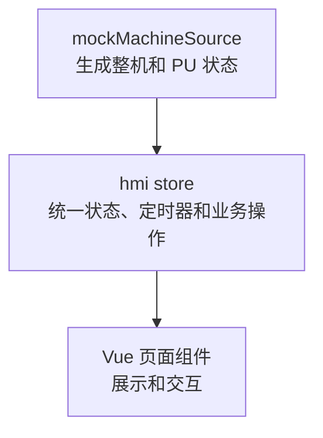

以及曲线数据链：

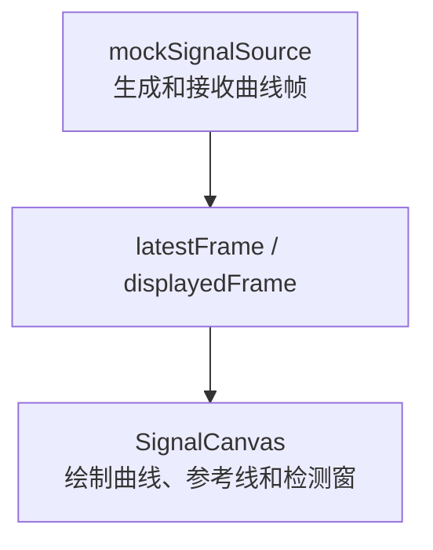

完成标准：不看 AI、不看笔记，能用 2 分钟说清整个工程结构。

### 2.2 攻克坐标换算（约 90 分钟）

这是题目最核心、当前最需要补强的部分。

需要熟练掌握以下公式：

```js
localX = clientX - canvasRect.left - plotLeft
localY = clientY - canvasRect.top - plotTop

dataX =
  viewport.xMin +
  (localX / plotWidth) *
  (viewport.xMax - viewport.xMin)

dataY =
  yMax -
  (localY / plotHeight) *
  (yMax - yMin)
```

必须能解释：

- `clientX/clientY` 相对于浏览器视口。
- Canvas 在页面中有自己的位置。
- 曲线实际绘图区还有上下左右边距。
- Canvas 的 Y 轴向下，信号数据的 Y 轴向上。
- 横坐标必须使用当前 `viewport`，不能永远按完整的 1200 点计算。
- 检测窗保存数据坐标，所以缩放或改变尺寸后不会漂移。
- `devicePixelRatio` 影响绘制清晰度，但不改变数据位置。

练习题：

> 当前视口为 `300～900`，绘图区宽度为 `1200px`，触点位于绘图区正中间，数据横坐标是多少？

计算过程：

```text
300 + 0.5 × (900 - 300) = 600
```

完成标准：面试官临时更换数据后，仍能现场推导。

### 2.3 掌握四条状态链（约 2 小时）

#### 曲线刷新链

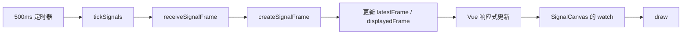

#### 曲线冻结链

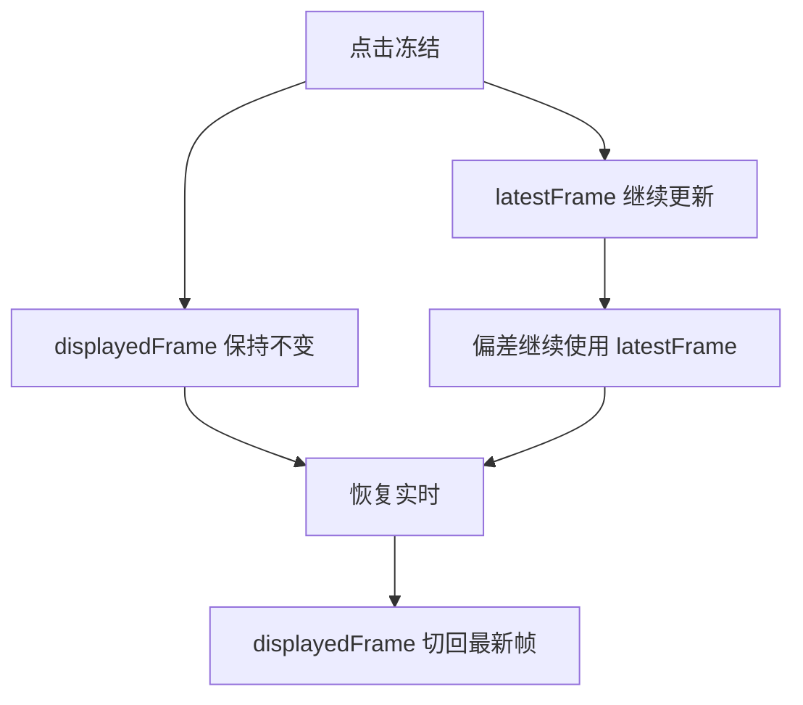

记忆句：

> 冻结显示，不冻结采集和业务计算。

#### 信号中断链

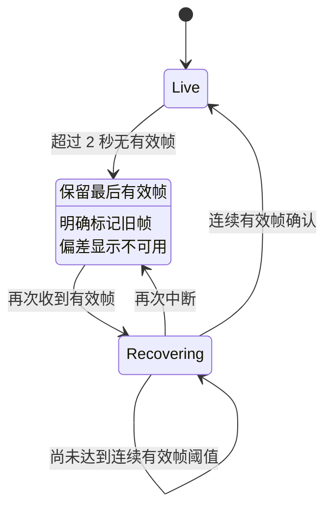

记忆句：

> 保留旧帧用于诊断，但禁止把旧帧当成实时结论。

#### 报警生命周期

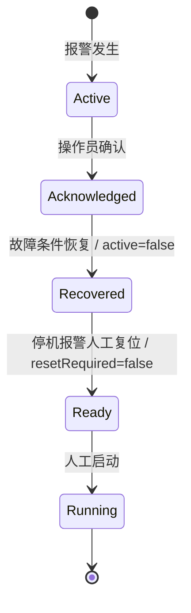

必须记住以下字段：

```js
active
acknowledged
resetRequired
occurredAt
acknowledgedAt
recoveredAt
resetAt
```

完成标准：不看代码，分别用 30～60 秒说清四条链。

### 2.4 练习 5 分钟功能演示（约 60 分钟）

演示顺序固定，不临场自由发挥。全程录屏并计时。

#### 0:00～0:40：需求理解

建议表达：

> 这是凹版印刷 Web HMI，核心用户是现场操作员。整机页解决快速判断整线状态和定位异常 PU，锁定标记页解决色标信号观察、检测窗设置和套色偏差判断。

#### 0:40～1:40：整机总览

展示并说明：

- 放卷、10 个 PU、收卷。
- 车速、运行状态和报警信息。
- PU 状态定时刷新。
- 为什么从 4:3 重新组织成 16:9。
- 为什么使用固定视角 2.5D，而不是自由视角 3D。

#### 1:40～2:20：定位 PU

展示：

- 单击 PU。
- 右侧详情同步更新。
- 从整机上下文进入对应锁定标记页面。

#### 2:20～3:50：曲线和检测窗

展示并说明：

- 每帧 1200 点、每 500ms 更新一次。
- 首色、前色、本色参考线。
- 新建检测窗。
- 拖动或调整检测窗。
- 应用检测窗。
- 草稿状态与正式窗口分离。
- 检测窗保存数据坐标，而不是屏幕像素。

#### 3:50～4:30：异常状态

展示并说明：

- 冻结曲线不会停止后台采集。
- 信号中断后保留最后有效帧。
- 信号恢复需要连续有效帧确认。

#### 4:30～5:00：边界总结

建议表达：

> 当前使用可复现的前端模拟数据，重点验证界面、交互、状态模型和 Canvas 性能。未来接入真实设备时会替换数据源适配层，并增加 WebSocket 数据质量、PLC 回执、权限、互锁和审计。

当天至少录制两遍，第二遍控制在 5 分 30 秒以内。

---

## 三、8 月 19 日：现场修改和完整模拟

建议投入 6～8 小时。

### 3.1 完成两个现场修改（约 3 小时）

操作时可以查项目，但第一遍尽量不让 AI 直接修改。

#### 修改练习一：恢复阈值配置化

需求：

> 信号恢复从连续 2 帧改为默认 3 帧，并显示 `2/3`。

练习步骤：

1. 全局搜索 `recoveryFrames`、`recovering` 和“恢复中”。
2. 定位 `mockSignalSource.js`。
3. 定位状态展示组件。
4. 增加恢复阈值配置。
5. 修改恢复判断。
6. 在 UI 展示恢复进度。
7. 分别测试收到 1、2、3 帧时的状态。
8. 运行构建和验收脚本。

重点不是最终功能，而是练习接到需求后如何定位代码。

#### 修改练习二：Y 轴量程配置化

需求：

> 把信号 Y 轴从固定 `0～100` 改成可配置的 `yMin/yMax`。

需要关注：

- `toData()`。
- `toScreen()`。
- Y 轴刻度。
- 检测窗边界限制。
- 默认检测窗。
- 相关测试。

每次修改完成后，口头回答：

```text
我改了哪些文件？
为什么改这些文件？
数据流发生了什么变化？
有哪些边界情况？
我是怎样验证的？
```

不要直接在唯一可演示版本上冒险。先保存一个明确可运行的版本，再练习修改。

### 3.2 准备 10 分钟代码走查（约 90 分钟）

建议按照以下顺序讲解：

1. `hmi.js`：整体状态、定时器和业务操作。
2. `mockMachineSource.js`：整机模拟数据。
3. `mockSignalSource.js`：曲线帧和信号状态。
4. `SignalCanvas.vue`：坐标换算、交互和绘图。
5. `signalMath.js`：峰值查找和偏差计算。
6. `hmiRules.js`：报警规则。

每个文件控制在 1～2 分钟，不逐行念代码。建议使用这种表达：

> 这个模块的输入是……输出是……我把它单独拆出来，是为了……如果接入真实设备，会替换或保留……

### 3.3 准备高频技术问题（约 90 分钟）

必须能够回答：

1. 为什么选择 Canvas，而不是 SVG？
2. Canvas 和 SVG 各自的优缺点是什么？
3. 1200 点每 500ms 为什么不会明显卡顿？
4. 数据增长到 12 万点后如何优化？
5. 为什么保存数据坐标？
6. 缩放后检测窗为什么不会漂移？
7. 为什么拆分 `latestFrame` 和 `displayedFrame`？
8. 为什么信号中断不能画成零？
9. 为什么报警确认后不能自动启动？
10. 接入 WebSocket 和 PLC 回执后如何改造？
11. 指令超时后为什么不能直接自动重发？
12. 为什么配置不能放在 `dist`？

性能问题的核心回答：

> 当前每秒只有两帧，每帧 1200 点，单次线性遍历和 Canvas path 绘制成本较低。数据变大后，先按 viewport 截取可见范围，再按屏幕像素做 min-max 降采样，必要时使用 Worker 和 requestAnimationFrame。

### 3.4 准备 AI 使用回答（约 45 分钟）

不建议说：

> AI 的好处是不用手写代码。

建议表达：

> AI 帮我降低了机械实现成本，加快了产品方案、脚手架、测试和代码初稿的生成。但进入项目的代码仍然由我负责理解、审查和验证。

需要主动说明本次教训：

> 这次我验证了功能是否能够运行，但对 AI 生成代码的接管不充分，导致我不能快速解释和修改部分模块。之后我会把“能够脱离 AI 解释、调试和修改”作为代码完成的标准。

AI 安全和团队治理需要记住三个关键词：

```text
公司批准的工具
最小必要上下文
人工审查与测试
```

关于团队使用 AI，可以这样回答：

> 我会按照任务风险决定 AI 的参与方式，而不是简单限制使用次数。脚手架、样板代码、测试数据、文档整理、方案对比和低风险重构适合使用 AI。业务流程、领域模型、设备控制、安全互锁和架构决策可以让 AI 提供建议，但最终判断必须由工程师完成。

> 涉及客户数据、设备协议、密钥和内部源码时，只能使用公司批准的模型和环境，遵循最小上下文原则，对敏感信息脱敏，并保留必要的使用记录。

> AI 代码合并前需要经过工程师审查、单元测试、集成测试、静态检查和安全检查。设备控制相关代码还需要领域人员复核，并在模拟环境验证异常、超时和重复指令场景。

> AI 效率不应该通过生成代码行数衡量，而应该比较需求交付周期、评审时间、返工率、线上缺陷、测试覆盖率和故障恢复时间。

### 3.5 完成一次完整模拟（约 60 分钟）

完整流程：

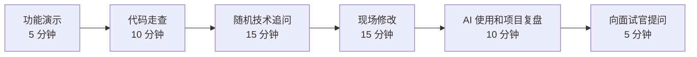

录音结束后检查：

- 是否频繁说“不知道”后就停止。
- 是否说错了技术原因。
- 是否回答过长，却没有先给结论。

不知道答案时可以使用：

> 这个细节我现在不能凭记忆确认。我会先搜索状态字段，沿着数据源、store、组件的链路定位，然后通过最小复现和测试确认。我的初步判断是……

---

## 四、8 月 21 日面试当天

建议 8:00 前起床，9:30 后不再修改代码。

### 4.1 8:00～8:40：最后一次运行检查

执行：

```bash
npm run test:acceptance
npm run build
```

确认：

- [ ] 浏览器缩放为 100%。
- [ ] 页面能够正常打开。
- [ ] PU 详情能够打开。
- [ ] 能够进入锁定标记页面。
- [ ] 能够创建、拖动和应用检测窗。
- [ ] 曲线持续刷新。
- [ ] 信号中断和恢复正常。
- [ ] 报警抽屉正常。

### 4.2 8:40～9:20：只复习一张 A4 纸

A4 纸只写：

- 5 分钟演示顺序。
- 坐标换算公式。
- 四条状态链。
- 六个核心文件。
- AI 使用反思。
- 准备向公司的三个反向问题。

### 4.3 9:20～9:40：准备设备和备份

- [ ] 本地可运行项目。
- [ ] 可运行的 `dist`。
- [ ] 演示录屏。
- [ ] 电脑和充电器。
- [ ] 鼠标。
- [ ] 网络备用方案。
- [ ] 投屏转接头。
- [ ] 关闭无关通知。

### 4.4 9:40 之后

- 不再增加功能。
- 不升级依赖。
- 不调整大面积样式。
- 不重构核心状态。
- 只复习演示、数据流、坐标公式和回答结构。

---

## 五、必须掌握的面试表达

### 5.1 项目定位

> 这是面向凹版印刷操作员的 Web HMI。整机页帮助操作员快速判断整线状态并定位异常 PU；锁定标记页用于观察光电眼信号、设置检测窗并判断套色偏差。

### 5.2 为什么使用固定视角 2.5D

> 早期考虑过 3D，但自由视角会增加操作和识别成本，也容易偏离题目的核心范围。固定视角能够让放卷、10 个 PU 和收卷的位置保持稳定，更适合工业现场快速判断，所以最终采用参数化的 2.5D Canvas。

### 5.3 为什么使用 Canvas

> 1200 点使用 SVG 的单个 polyline 也可以实现，但页面还需要频繁叠加曲线、网格、参考线、检测窗、颜色条和游标。Canvas 可以在一个绘图上下文中顺序完成这些图层，频繁重绘时开销更加可控，因此我选择了 Canvas。

### 5.4 检测窗的作用

> 一帧信号中可能同时存在多个脉冲、噪声和异常波动，因此不能简单在整条曲线上寻找全局最大值。检测窗负责限定有效搜索范围，系统只在窗口内寻找目标峰值，再与参考位置比较并换算偏差。

### 5.5 模拟数据和真实设备的边界

> 当前版本使用可复现的前端模拟数据，主要验证页面交互、Canvas 性能和业务状态模型。真实接入时会通过数据适配层替换模拟源，同时补充 WebSocket 数据质量、PLC 指令回执、权限、互锁和操作审计。

### 5.6 AI 使用定位

> 我使用 AI 加快了需求分析、方案探索和部分实现，但这次也认识到功能跑通不等于工程师已经掌握。进入项目的代码最终仍然由我负责理解、审查、调试和验证。之后我会把能够脱离 AI 解释和修改作为代码完成的标准。

---

## 六、现场修改的工作方法

拿到需求后按以下顺序处理：

1. 复述需求和验收标准。
2. 搜索相关状态字段和界面文案。
3. 沿数据源、store、组件定位完整链路。
4. 说明预计修改的文件和风险。
5. 先做最小改动。
6. 验证正常路径和异常边界。
7. 运行已有测试和构建。
8. 向面试官总结改动和验证结果。

不要在没有确认数据链路前直接让 AI 大面积修改。

---

## 七、最终自检清单

### 功能演示

- [ ] 能在 5 分钟左右完成完整演示。
- [ ] 能说明两个页面分别解决什么业务问题。
- [ ] 能说明从 4:3 到 16:9 的信息重组。
- [ ] 能说明 3D 到固定视角 2.5D 的取舍。
- [ ] 能完成一次检测窗新建、调整和应用。
- [ ] 能演示曲线刷新、冻结、中断和恢复。

### 技术讲解

- [ ] 能手写屏幕坐标到数据坐标的公式。
- [ ] 能解释 Y 轴为什么需要反向。
- [ ] 能解释 viewport 和 DPR。
- [ ] 能讲清曲线从数据源到 Canvas 的链路。
- [ ] 能解释 `latestFrame` 和 `displayedFrame`。
- [ ] 能解释报警确认、恢复、复位和启动。
- [ ] 能解释 Canvas 与 SVG 的取舍。
- [ ] 能说明 12 万点时的优化方案。

### 现场修改

- [ ] 能通过搜索快速定位相关代码。
- [ ] 能独立完成恢复阈值配置化。
- [ ] 能独立完成 Y 轴量程配置化。
- [ ] 能说明修改涉及的文件、数据流和测试。

### AI 与项目复盘

- [ ] 能诚实说明自己和 AI 分别完成了什么。
- [ ] 不使用“AI 的价值是不需要手写代码”这样的表达。
- [ ] 能说明 AI 代码的人工审查和验证责任。
- [ ] 能说明客户数据、协议和内部代码的安全边界。
- [ ] 能说明这次使用 AI 的不足和改进措施。

---

## 八、面试核心策略

不需要假装所有代码都是手写的。公司鼓励使用 AI，隐瞒使用情况反而会增加风险。

面试时需要让面试官看到三件事：

1. 设计取舍能够独立解释。
2. 进入项目的代码愿意并能够负责。
3. 遇到不熟悉的代码，可以通过搜索、数据流和测试快速接管。

这两天不要继续让 AI 给项目增加功能，而应让 AI 作为面试官持续追问。每当回答不上来，就回到对应文件亲自找到答案，再用自己的语言复述。

面试前至少确保以下四项可以脱离 AI 完成：

- 坐标换算。
- 曲线数据链。
- 报警生命周期。
- 两个现场小改动。

---

## 九、高频技术问题参考答案

> 使用方法：先闭卷回答，再看参考答案。不要逐字背诵，记住“结论 → 当前项目 → 原因 → 扩展”四层结构。面试时通常回答 60～90 秒，面试官继续追问后再补充扩展方案。

### 9.1 为什么选择 Canvas，而不是 SVG？

参考回答：

> Canvas 和 SVG 都能实现 1200 点曲线，我没有认为 SVG 一定不行。SVG 更适合元素数量较少、需要独立事件和 CSS 样式的矢量图形；Canvas 是即时位图绘制，没有图形 DOM，适合把网格、曲线、参考线、检测窗、游标和颜色条统一放在一次绘制流程中频繁更新。当前曲线每 500ms 全量刷新，检测窗拖动时还会连续重绘，因此我选择 Canvas，让重绘成本更可控。代价是命中检测、坐标换算和无障碍能力需要自己实现。

项目依据：

- `src/components/SignalCanvas.vue` 的 `draw()` 顺序绘制全部图层。
- `hitWindow()` 自己完成检测窗命中判断。
- `toData()` 和 `toScreen()` 自己完成坐标双向换算。

不要说：

> SVG 每个数据点都是一个 DOM。

因为 SVG 可以使用一个 `<path>` 或 `<polyline>` 绘制整条曲线，不一定创建 1200 个节点。

### 9.2 Canvas 和 SVG 各自有什么优缺点？

参考回答：

> SVG 是保留模式：每个图形元素由浏览器保留，便于使用 DOM 事件、CSS、无障碍属性和矢量缩放，适合图标、流程图以及节点数量有限的交互图。图形节点很多且高频修改时，会产生 DOM、样式计算和布局管理开销。Canvas 是即时模式：绘制后浏览器不再保留每条线的对象，批量高频绘制更直接，但需要自己管理重绘、命中测试、坐标变换和清晰度。这个项目的整机结构与实时曲线都属于集中绘制、频繁更新，所以使用 Canvas；如果只是少量可点击的独立部件，SVG 也会是合理选择。

### 9.3 1200 点每 500ms 为什么不会明显卡顿？

参考回答：

> 当前每秒只有 2 帧，每帧 1200 个点。数据生成和绘制都是线性复杂度，一帧主要遍历一次点数组，并使用一个 Canvas path 统一 stroke，没有创建大量 DOM。视口外的点也不会进入绘制路径。在这个规模下，脚本和绘制耗时通常远小于 500ms，因此能够流畅运行。60Hz 屏幕不是不会卡顿的原因；是否卡顿要看主线程每帧计算、绘制、长任务和内存分配。我会使用浏览器 Performance 面板验证，而不是只凭刷新率判断。

当前数据链：

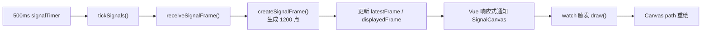

### 9.4 数据增长到每帧 12 万点后如何优化？

参考回答：

> 我会先区分“采集完整性”和“显示完整性”：原始数据可以完整接收或保存，但屏幕没有必要逐点绘制 12 万个点。第一步根据 viewport 直接计算可见数组的起止索引，避免遍历所有数据；第二步按照 Canvas 像素宽度做 min-max 分桶，每个像素列保留最小值和最大值，避免简单抽点丢失尖峰；第三步使用 TypedArray 降低对象和 GC 开销；数据解析和降采样较重时放进 Web Worker。显示更新通过 requestAnimationFrame 与浏览器绘制节奏同步，绘制不及时则展示最新完整帧，而不是积压过期帧。数据量再增大时再评估 OffscreenCanvas 或 WebGL。

关键词顺序：

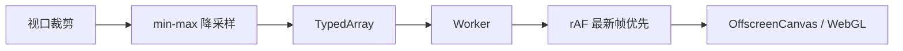

### 9.5 为什么检测窗保存数据坐标，而不是屏幕像素？

参考回答：

> 检测窗属于业务配置，它描述的是采样范围和信号强度范围，所以保存 `xMin/xMax/yMin/yMax` 数据坐标。屏幕像素只与当前 Canvas 尺寸、浏览器缩放和 viewport 有关。如果保存像素，改变分辨率、缩放或平移后，检测窗就会指向不同的信号区域。当前项目把像素换算集中在 `SignalCanvas.vue`，Store 和 `signalMath.js` 只接收业务坐标，因此偏差计算与显示尺寸解耦。

### 9.6 缩放后检测窗为什么不会漂移？

参考回答：

> 缩放只修改 `state.viewport.xMin/xMax`，检测窗的数据坐标没有变化。绘制时 `toScreen()` 根据最新 viewport 把同一组数据坐标重新映射成屏幕位置；交互时 `toData()` 再把触点映射回当前 viewport 中的数据位置。因此缩放改变的是观察范围，不是检测窗对应的采样范围。

核心公式：

```js
dataX = viewport.xMin
  + (localX / plotWidth)
  * (viewport.xMax - viewport.xMin)

screenX = plotLeft
  + ((dataX - viewport.xMin)
  / (viewport.xMax - viewport.xMin))
  * plotWidth
```

Y 轴需要反向：

```js
dataY = 100 - (localY / plotHeight) * 100
```

因为 Canvas 原点在左上角，屏幕 Y 值向下增大；信号坐标则从底部的 0 向上增大。

### 9.7 `devicePixelRatio` 会不会影响检测窗位置？

参考回答：

> 不应该影响。交互换算使用 `getBoundingClientRect()` 返回的 CSS 像素；Canvas backing store 按 DPR 放大，再用 `ctx.setTransform(dpr, 0, 0, dpr, 0, 0)` 让绘制逻辑继续使用 CSS 像素。DPR 只提高曲线和文字清晰度，不进入业务坐标换算。如果把 backing store 像素和 CSS 像素混用，才会出现命中位置偏移。

### 9.8 为什么拆分 `latestFrame` 和 `displayedFrame`？

参考回答：

> 两者分别代表采集链路和展示链路。`latestFrame` 始终保存后台最新有效数据，供偏差和报警计算使用；`displayedFrame` 是操作员当前看到的画面，可以因为手动冻结或编辑检测窗而保持不变。这样冻结只冻结显示，不会冻结采集和业务判断。恢复实时后，`displayedFrame` 再切回 `latestFrame`。如果只保存一个 frame，要么后台更新会破坏冻结效果，要么冻结会连业务计算一起停止。

项目字段：

```js
latestFrame
displayedFrame
latestReceivedAt
displayedAt
freezeMode // live / manual / edit
```

### 9.9 为什么信号中断后保留最后一帧，不能清空或画成零？

参考回答：

> 清空会丢失故障发生前的诊断上下文，画成零则是在伪造一帧实际没有收到的数据，容易被误解成真实的零信号或设备故障。当前项目超过 2 秒没有有效帧后进入 `interrupted`，保留最后有效画面并明确覆盖“当前显示最后有效帧”，同时停止输出实时偏差。恢复后连续收到两帧有效数据才回到 `live`，用于避免偶发单帧让状态在中断和实时之间抖动。保留旧帧是为了诊断，不代表旧帧仍可作为实时测量结论。

### 9.10 为什么报警确认后不能自动启动？

参考回答：

> 报警确认只表示操作员已经看到报警，不代表故障条件消失。停机级报警需要依次经历报警发生、操作员确认、条件恢复、人工复位和新的启动指令。复位也只是清除锁存并重新建立启动许可，不等于设备应该自动动作。把确认和启动合并，会在人员仍在排障时产生安全风险。

当前复位条件：

```js
severity === 'stop'
&& resetRequired
&& !active
&& acknowledged
```

生命周期字段：

```js
active
acknowledged
resetRequired
occurredAt
acknowledgedAt
recoveredAt
resetAt
```

### 9.11 接入 WebSocket 和 PLC 回执后如何改造？

参考回答：

> 我会保留页面组件、Canvas、统一领域数据结构以及大部分报警和检测窗规则，替换模拟数据源并增加独立命令层。数据流是 PLC 网关到 WebSocket transport，再经过协议解析、类型与范围校验、数据适配器，转换成当前 Store 使用的 machine、alarms 和 SignalBucket。组件不直接解析原始报文。操作员点击启动后，前端可以做已知条件预检查，但最终许可由 PLC 决定；界面进入 sending、accepted、executing、succeeded、rejected 或 timeout，只有 PLC 回执和后续遥测确认运行后才显示 run。

建议数据流：

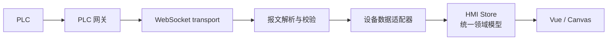

连接异常处理：

- 报文包含 `sourceId`、`sequence`、`timestamp`、`quality`。
- 使用 `sourceId + sequence` 去重并丢弃过期乱序帧。
- 序号缺口记录丢帧；全量曲线可以采用最新有效完整帧优先。
- WebSocket 断线使用有上限并带随机抖动的指数退避重连。
- 重连成功后拉取完整快照，不能假设断线期间状态未变化。
- 单个 PU 数据超时和整个连接断开必须分别建模。

### 9.12 指令超时后为什么不能直接自动重发？

参考回答：

> 超时只表示前端没有按时收到结果，不代表 PLC 没有执行。启动、停止或复位等指令如果不是天然幂等，自动重发可能造成重复动作。更安全的做法是把状态标记为“结果未知”，使用 commandId 查询设备实际状态；确认未执行后，再由操作员重试，或者通过幂等键安全重发。操作、回执、超时和重试都应记录审计日志。

### 9.13 为什么配置不能放在 `dist`？

参考回答：

> `dist` 是 `npm run build` 生成的构建产物，重新构建时会被覆盖，文件通常还经过哈希、压缩和打包，不应该直接维护。如果配置跟随代码发布，可以放在 `src/config`；如果需要部署后按设备修改，可以放在 `public` 下的外部 JSON 并在启动时加载；生产系统也可以从后端或配置中心获取。配置进入业务层前还要校验范围并提供安全默认值。

### 9.14 为什么检测窗要区分草稿和已应用状态？

参考回答：

> 工业参数不应该在手指拖动过程中立即覆盖正在使用的配置。当前 `windows` 保存已应用窗口，`draftWindows` 保存编辑草稿，`windowEditSnapshots` 保存进入编辑前的快照。拖动只改变草稿，正式偏差仍使用已应用窗口；点击应用后才替换并写入 sessionStorage，取消则丢弃草稿。离开页面或切换 PU 前还会检查未应用修改，避免静默丢失。

### 9.15 当前项目有哪些架构优点和局限？

参考回答：

> 优点是模拟数据源与页面分离，`hmiRules.js` 和 `signalMath.js` 使用纯函数，Canvas 只接收 props 并上报业务坐标，检测窗草稿与正式状态分离，显示帧与最新帧分离。这些设计让规则可测试，也方便未来替换数据源。局限是 `hmi.js` 职责较多，没有 TypeScript、Pinia 和 Vue Router，测试主要覆盖纯函数和虚拟时间线，没有完整组件测试和端到端测试；同时缺少真实通信、命令回执、权限、审计和持久化。生产化时应按领域拆 Store、增加数据契约和命令服务，而不是简单把 WebSocket 塞进页面组件。

---

## 十、针对本项目的精简八股文

> 结论：需要准备，但只占最后准备时间的 20%～30%。优先掌握与项目强相关的 Vue、JavaScript 异步、浏览器渲染、Canvas、WebSocket 和存储。不要在面试前一天大量背冷门题。

### 10.1 `ref`、`reactive`、`computed` 和 `watch` 有什么区别？

参考回答：

> `ref` 用于包装一个可响应的值，通过 `.value` 访问；`reactive` 用 Proxy 让对象属性响应式；`computed` 根据其他响应式状态生成有缓存的派生值，依赖不变时不会重复计算；`watch` 用于状态变化后的副作用，例如重新绘图、请求或同步外部系统。当前项目用 `reactive` 保存 HMI state，用 `computed` 生成当前 PU、报警统计和偏差，用 `watch` 在 SignalCanvas 的输入变化后调用 draw。能用 computed 表达的业务结论，不应额外维护一份容易失去同步的状态。

### 10.2 Vue 为什么强调单向数据流？

参考回答：

> 父组件通过 props 向下传数据，子组件通过 emit 向上报告事件。子组件不应直接修改 props，否则状态来源不明确。当前 SignalCanvas 接收 frame、windowData 和 viewport，并通过 `change`、`pan`、`interaction-start`、`interaction-end` 报告操作；草稿、应用和持久化由 Store 决定，这使绘图组件与业务规则分离。

### 10.3 `computed` 和普通方法有什么区别？

参考回答：

> computed 根据响应式依赖缓存，依赖不变时重复访问会复用结果；普通方法每次调用都会执行。computed 适合报警统计、当前选中 PU、是否可启动等派生状态，方法适合带参数或执行动作。computed 应保持无副作用，不应该在计算过程中修改状态或发请求。

### 10.4 `watch` 使用不当会有什么问题？

参考回答：

> 深度 watch 大对象可能增加遍历成本；多个 watch 互相修改依赖可能产生循环更新；忘记清理外部监听和定时器会造成泄漏。当前 SignalCanvas 监听 frame、windowData、viewport 等输入并重绘，组件销毁时断开 ResizeObserver；Store 在卸载时清理 interval、timeout 和 popstate 监听。

### 10.5 `v-if` 和 `v-show` 有什么区别？

参考回答：

> `v-if` 会真实创建和销毁组件，切换成本较高但隐藏时没有对应 DOM；`v-show` 始终保留 DOM，只切换 `display`，适合高频显示隐藏。当前两个主页面通过 `v-if/v-else` 切换，因为它们是独立的大页面；如果是高频开关的小提示，可以考虑 `v-show`。

### 10.6 为什么列表需要稳定的 `key`？

参考回答：

> key 帮助 Vue 在 diff 时识别节点身份，避免数据顺序变化后错误复用组件状态。应使用 alarm.id、station.id 这类稳定业务 ID，不应在可重排列表中使用数组索引。

### 10.7 JavaScript 事件循环、宏任务和微任务是什么？

参考回答：

> JavaScript 主线程执行一个宏任务后，会清空当前微任务队列，再进入渲染机会和下一个宏任务。Promise 回调属于微任务，`setTimeout` 和 `setInterval` 回调属于宏任务。大量连续微任务也可能阻塞渲染。当前 500ms 和 1s 定时器只表示最早可执行时间，主线程繁忙时会延迟，因此真实设备数据必须依赖报文时间戳和序号，不能把定时器触发时间当成精确采样时间。

### 10.8 `requestAnimationFrame` 和 `setInterval` 如何选择？

参考回答：

> `setInterval` 适合表达数据模拟或轮询节奏，但不能保证准时；`requestAnimationFrame` 在浏览器下一次绘制前执行，适合视觉动画和高频 Canvas 绘制。当前模拟源每 500ms 生成业务帧，Canvas 收到帧后重绘；如果数据提高到高频，我会继续独立接收数据，但用 rAF 合并绘制，始终画最新完整帧，避免过期绘制任务积压。

### 10.9 防抖和节流有什么区别？

参考回答：

> 防抖是在事件停止一段时间后只执行一次，适合搜索输入和窗口尺寸变化后的最终处理；节流是在连续事件中限制执行频率，适合滚动、指针移动和高频状态上报。Canvas 拖动要求跟手，不能简单长时间防抖；可以使用 rAF 节流视觉绘制，并在 pointerup 时提交最终业务坐标。

### 10.10 浏览器从数据变化到页面显示经历什么？

参考回答：

> JavaScript 修改状态后，Vue 调度组件更新；浏览器随后进行样式计算、必要的布局、绘制和合成。修改几何尺寸或位置可能触发布局，颜色和阴影通常触发绘制，transform 和 opacity 在条件合适时主要由合成阶段处理。频繁交替读取布局信息和写入样式可能造成强制同步布局。当前 Canvas 在 draw 开始读取一次 bounding rect，再集中完成绘制，避免在点循环中反复读取 DOM 布局。

### 10.11 什么是重排、重绘和合成？

参考回答：

> 重排是元素几何和布局重新计算，通常成本最高；重绘是像素外观重新绘制但布局不变；合成是将已有图层组合显示。性能优化不能只说“避免重排”，还要通过 Performance 面板确认瓶颈。Canvas 内部绘制不会为每个点触发 DOM 布局，但每次 draw 仍会产生 Canvas 像素绘制成本。

### 10.12 `sessionStorage`、`localStorage` 和内存状态有什么区别？

参考回答：

> 内存状态刷新后消失；sessionStorage 以标签页会话为范围，关闭标签页后通常清除；localStorage 跨会话保存且同源共享。两种 Storage 都是同步 API，不适合大量高频数据，也不能作为生产审计。当前检测窗使用 sessionStorage，只为了演示会话内保留；真实配方和审计需要后端持久化、权限和版本控制。

### 10.13 WebSocket、HTTP 轮询和 SSE 如何选择？

参考回答：

> HTTP 轮询实现简单，适合低频数据但有请求开销和延迟；SSE 是服务器到浏览器的单向文本流，支持自动重连，适合事件通知；WebSocket 是全双工长连接，适合设备状态、曲线和指令回执的双向实时场景。真实 HMI 可以使用 WebSocket 接收高频状态，但控制指令仍要有 commandId、权限、幂等、回执和超时状态，不能因为用了 WebSocket 就默认消息可靠且业务执行成功。

### 10.14 WebSocket 断线重连要注意什么？

参考回答：

> 使用有最大值和随机抖动的指数退避，避免大量客户端同时重连；连接建立后重新认证并拉取完整快照；通过 sequence、timestamp 和 quality 处理重复、乱序和过期数据；区分连接断开与某个数据源超时；页面离开时关闭连接或取消订阅。断线期间的控制按钮还应根据安全策略禁用或明确标记结果未知。

### 10.15 如何避免前端内存泄漏？

参考回答：

> 常见来源包括未清理的定时器、DOM 或 window 事件、Observer、WebSocket、未结束请求以及被闭包长期引用的大对象。组件销毁时要对称清理。当前 `useHmi()` 清理 machineTimer、signalTimer、toastTimer、editTimers 和 popstate，Canvas 断开 ResizeObserver；如果未来增加 WebSocket，也要在应用或订阅生命周期结束时取消监听和关闭连接。

### 10.16 浅拷贝和深拷贝在当前项目中有什么意义？

参考回答：

> 展开运算符只复制一层，嵌套对象仍共享引用；深拷贝会复制整个对象图。检测窗对象只有一层字段，因此 `{ ...window }` 足够用于快照；整机快照包含嵌套 stations、unwind 和 alarms，所以模拟源使用结构化克隆或 JSON 回退，避免修改输入对象。生产代码还要考虑 Date、Map、循环引用和性能，不能把 JSON 拷贝当成通用方案。

### 10.17 什么是纯函数，为什么 `signalMath.js` 和 `hmiRules.js` 适合写成纯函数？

参考回答：

> 纯函数对相同输入返回相同输出，并且不修改外部状态。偏差计算和报警规则只依赖参数，不需要 Vue 或 DOM，因此容易进行单元测试、复用和未来迁移。副作用集中在 Store 和数据源层，能减少业务规则散落在组件中的风险。

### 10.18 当前测试覆盖了什么，还缺什么？

参考回答：

> 当前 `scripts/acceptance.mjs` 使用 Node assert，覆盖 90 秒场景、1200 点、确定性参考线、报警汇总和生命周期、检测窗相等判断、复位与显式启动，以及虚拟运行 5 分钟。它没有覆盖真实浏览器中的 Canvas 拖拽、坐标换算交互、Vue 组件渲染、键盘焦点、截图和完整端到端流程。现场改动后至少运行验收和 build，并手工回归相关浏览器场景；正式项目应补纯函数单测、组件测试和 Playwright 类端到端测试。

---

## 十一、面试前一天和当天的最终注意事项

### 11.1 今晚的准备顺序

不要再通读所有材料，按以下顺序完成：

1. 30 分钟：不看文档，完整演示一遍并录屏。
2. 45 分钟：只复习第九节高频问题，重点是坐标、状态链和真实设备接入。
3. 45 分钟：独立完成一个最小现场修改，练习搜索和定位，不追求增加新功能。
4. 30 分钟：闭卷讲解 6 个核心文件。
5. 20 分钟：复习第十节精简八股，只看答不出来的题。
6. 运行 `npm run test:acceptance` 和 `npm run build`，确认演示版本稳定。
7. 保存可运行版本，停止修改，保证睡眠。

如果时间不足，删除第 5 步，而不是删除项目演示和代码走查。

### 11.2 明天不要做的事

- 不新增功能。
- 不大改 UI。
- 不升级依赖。
- 不临时重构 `hmi.js`。
- 不直接修改 `dist`。
- 不让 AI 在面试前大面积改动代码。
- 不熬夜背冷门八股。

### 11.3 投屏和演示准备

- 提前打开项目、终端、浏览器和 6 个核心文件。
- 浏览器保持 100% 缩放，关闭通知和无关窗口。
- 准备本地开发环境、构建后的 `dist`、演示录屏三重备用。
- 不依赖现场网络安装依赖。
- 提前确认投屏转接头、电源、鼠标和分辨率。
- 演示前刷新页面，让模拟场景从确定状态开始。
- 先走一遍最短成功路径，异常功能按面试官追问再展示。

### 11.4 回答问题的统一结构

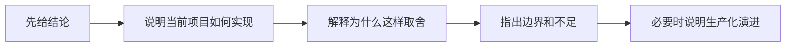

不要一开始就长篇铺垫。遇到不会的问题，可以说：

> 这个细节我现在不能凭记忆确认。我的初步判断是……我会先搜索相关状态字段，再沿数据源、Store 和组件确认完整链路，最后通过最小测试验证。

如果查看代码后发现刚才说错，应主动纠正：

> 我刚才有一处判断需要修正。当前代码实际是……依据在……这也说明这里后续可以如何改进。

### 11.5 现场修改的安全流程

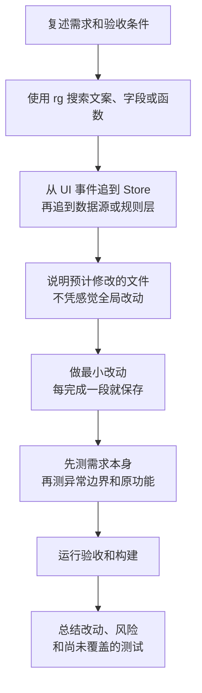

现场允许使用 AI 时也不要直接说“帮我完成整个需求”。应先自己定位，再让 AI 处理边界明确的小部分；合并前逐行检查，并能解释每处修改。

### 11.6 最值得准备的三个反问

可以根据现场交流选择 2～3 个：

1. 目前前端与 PLC 或设备网关之间的数据协议和职责边界是怎样的？前端团队会参与协议设计和现场联调吗？
2. 公司鼓励使用 AI，目前在代码、客户数据和内部资料方面有哪些批准工具与安全规范？团队如何进行 AI 代码评审？
3. 这个岗位入职前三个月最希望解决的问题是什么？衡量工作完成度更看重交付速度、现场稳定性还是产品体验？

不要一开始询问加班、假期或只问公司能提供什么；也不要完全不提工作内容和成功标准。

### 11.7 最后提醒

明天决定面试结果的优先级是：

```text
作品能稳定运行
> 能解释核心代码和业务状态
> 能搜索并完成小改动
> AI 使用责任边界清楚
> 精简八股回答
```

八股需要准备，但不要把它放在作品之前。对这场实操二面来说，能结合自己的文件、函数、字段和测试回答，比背一段标准定义更有说服力。
